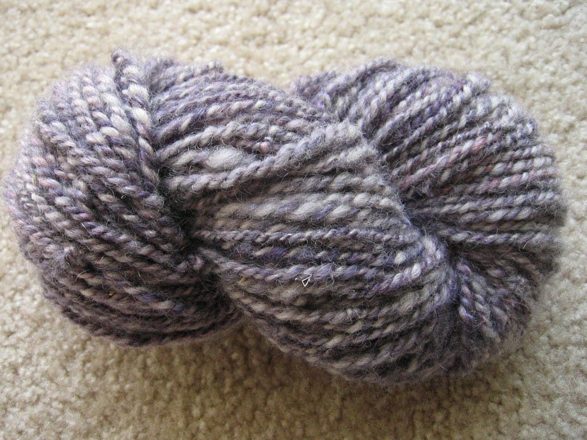
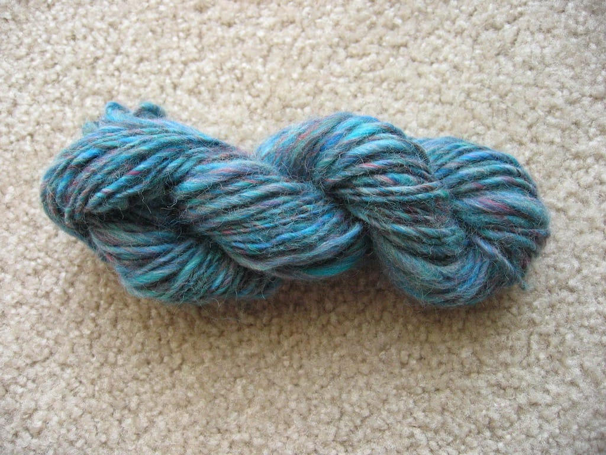

Look what I finally plied!

Well, I actually plied it last week and set the twist on Monday, but I just got around to posting pictures of the completed yarn today. I LOVE how it turned out; the weight's a bit heavier than worsted and I'm not sure how much yardage this bad boy has, but it's good enough for a small project like a hat or simple purse. I'll find something to knit from it eventually.

I also snapped a picture of the very first yarn I ever spun, over the course of a year and a half starting in [late 2004](/posts/spinning-hell)! I stopped and started spinning this over and over again, but I finally decided to skein it up and make it look somewhat presentable.

I didn't bother setting the twist on this one; it had been sitting on my first spindle for awhile and, well, I didn't feel like it, to be honest. I do really like the blue color of the yarn, but I'm not sure what I can knit with this. It definitely doesn't have much yardage and I don't know if there's a project small enough to actually utilize this. Maybe I'll keep it for show, to tell people about my very first spun bit of yarn.

I've begun spinning another ball of roving I bought at the Fleece Fair a few weeks ago, a beautiful brown/pink/orange mix that reminds me of fall. Just what I need in April, right? I'm spinning this yarn pretty thin; I'm hoping it will turn out around lace-weight so I can knit the [Branching Out](http://knitty.com/ISSUEspring05/PATTbranchingout.html) scarf with it. The colors match my brown coat almost perfectly, so I'd definitely wear it with that once the weather gets cold in the autumn. I'm excited to spin my first laceweight yarn, and even more excited to enter the world of lace knitting.

