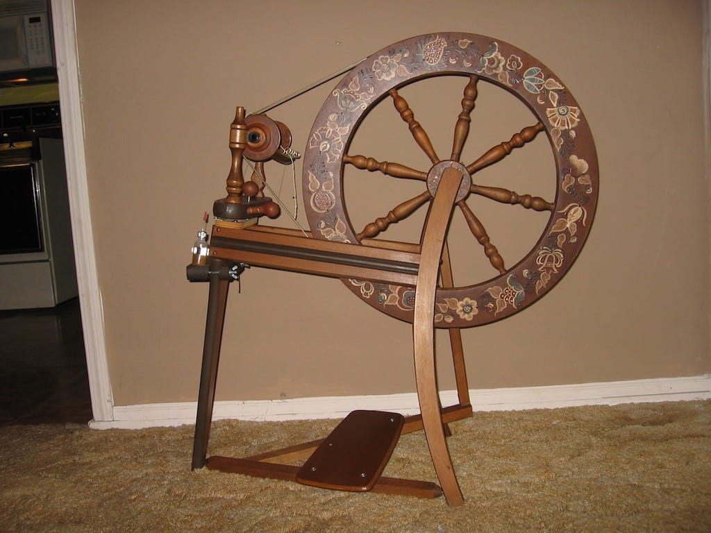
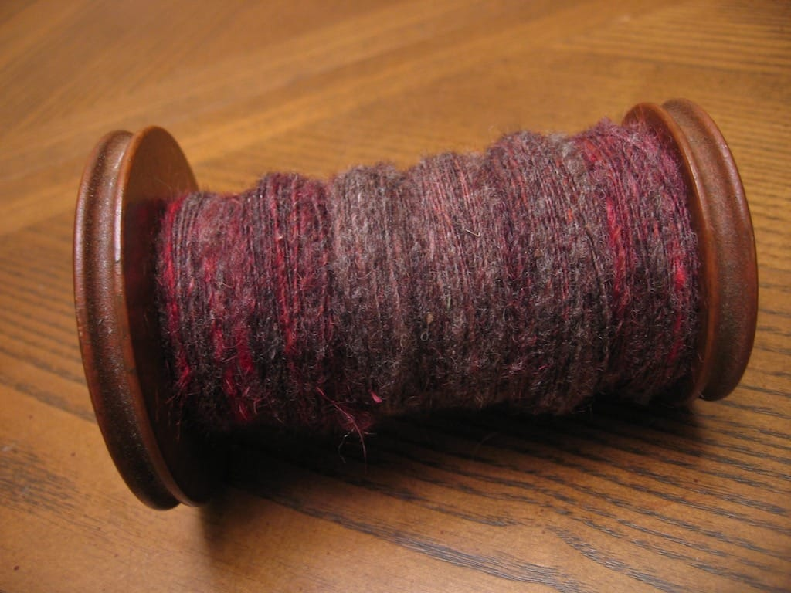

I first learned of spinning my own yarn at the end of 2004, when a few friends of mine purchased drop spindles and roving from a store on ebay. Intrigued, I ordered my own kit, wanting to spin myself my own beautiful yarn. However, I didn’t anticipate it being so difficult, and I struggled for a month or two, not knowing which way to spin my spindle, not knowing how to control the spin or the flow, before I put my spindle and beautiful blue-green roving away. I always talked of properly learning to spin, but I didn’t know anybody in Bloomington who also spun, and I didn’t know who to ask.

Fast-forward to about a year ago. I’m married, living in South Bend, and slowly but surely getting to know a few fellow knitters and spinners in the area. After attending meetings and watching my new friends spin on their spindles and wheels, I decide to try again. However, after getting advice from a few spinners, I decide to try a different type of spindle to spin my roving. I watch my friends spin, and all of a sudden, it makes sense. I watch them for a bit, then I try my own. My yarn doesn’t look perfect, but it doesn’t look totally bad, either. I finally learned it, and at that point, I knew I wanted to invest in my own wheel someday.

A year later, I’ve achieved that goal. A woman in the fiber group I belong to put a few of her wheels up for sale, and this past Tuesday, I tested a few of them. I’ve only spun on three wheels now; a Majacraft Millie, a tiny Cabriolet, and my new wheel, an Ashford Traditional. With the Millie, I was able to spin just fine after a little bit of trial and error, and I struggled with the Cabriolet. However, as soon as I sat down in front of the Ashford and began to spin, I knew this wheel was the one for me. I honestly couldn’t believe how easy it was for me to spin on this wheel; I attribute much of it to the fact that I’ve been spindle spinning exclusively for a year, so I’ve had time to perfect my technique. The woman I bought the wheel from told me I must have a lot of patience for spinning on a spindle for so long, and I’m inclined to agree with her.

I’ve been spinning every day since bringing home the wheel on Tuesday night. By Thursday, I finished the fiber I began at the end of May last year on the spindle, and I’m almost done spinning a 1.5 ounce bit of Shetland lambswool in different shades of pink I bought from [Vicki](http://simpleknits.blogspot.com) earlier in the year. I’m so excited to finally be spinning up all the fiber I’ve purchased within the past year! I’m going to need to buy myself a niddy-noddy and a lazy kate for when I ply and skein up my new yarn, but I can get around just fine without these items for now. If anyone can point me to any places that may sell these items for cheap, I would appreciate it, as I’d much rather keep my bobbins in place while plying them together instead of them rolling all around the floor, and I’d rather not wrap my yarn around the end of my kitchen table. But that’s just me.

In short, I’m very happy with my purchase. Let the spinning commence!

