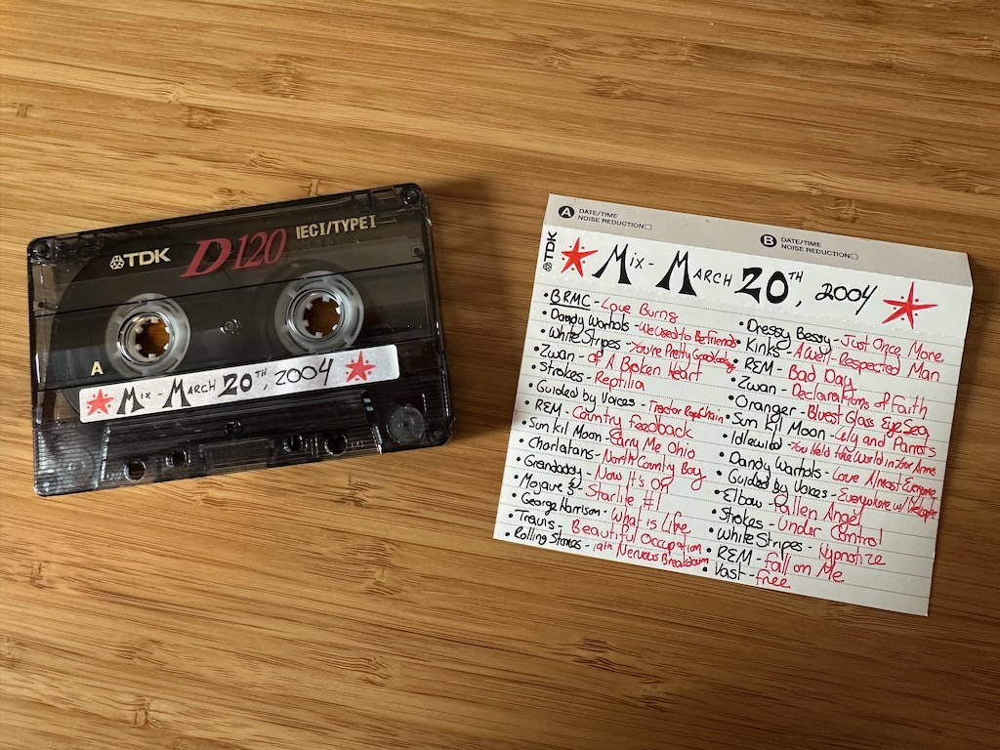
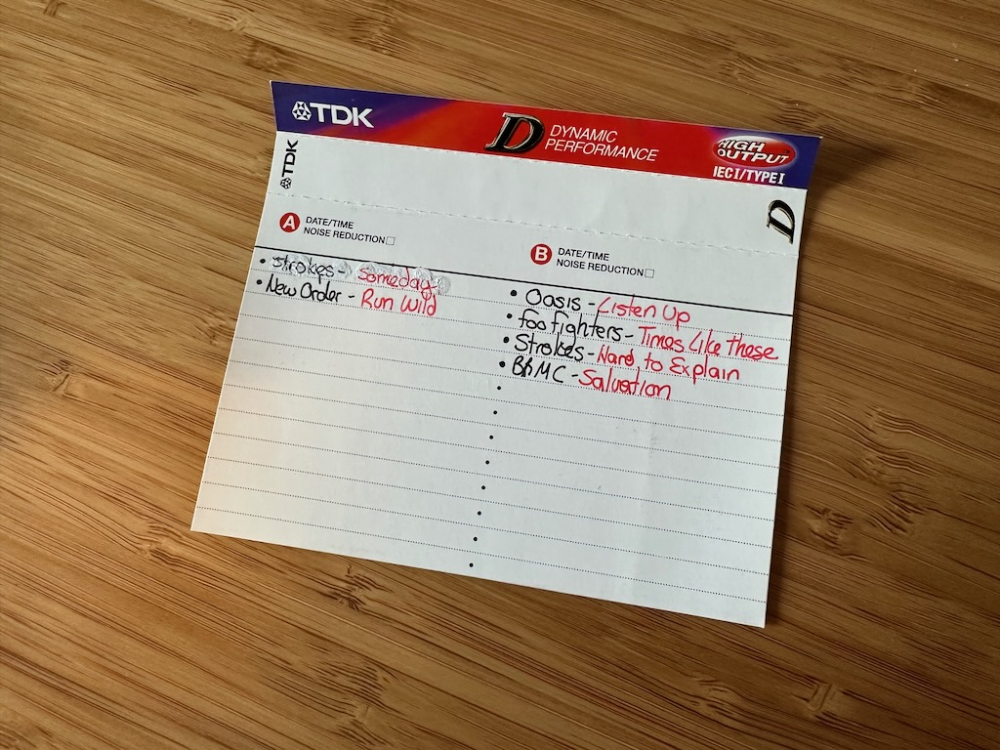

I’ve been [writing many blog posts about albums I was too cool for in the mid-00s](tags/im-too-cool-for-this-album/), so let’s change it up for a second. What was I actually listening to in that time frame? What did I deem to be cool enough for mid-20s me? Do I still even *listen* to some of this stuff? Let’s find out!

***

I created many a mix tape in the late 90s and early 2000s. I received a boom box with two cassette players and a CD player for my 17th birthday in 1997, and since my main hobby at the time was listening to music on the radio, finding songs I loved and trying to find out more about them without going on the internet (I wasn’t quite online yet in 1997!), I couldn’t wait to start making mix tapes from the CDs I owned and songs I taped off the radio.

I compiled so many mix tapes while I was in high school in the late 90s, and when I finally received my driver’s license in 2000, I started rocking the streets of western Massachusetts in my 1997 Toyota Camry with all the tapes I had created. I didn’t make as many once I hit college, and once I bought my very first CD burner, I started making mix CDs instead of tapes. (I still like mix tapes better, for the record.)

Finally, in 2004, I created my last mix tape. It was kind of a last hurrah for me; I knew I’d never make another one again because hey, 2004! CDs still reigned supreme for a couple more years, but the iPod started becoming the de facto way to listen to music and cassettes started becoming less and less popular. Still, I wanted to make this particular mix a tape instead of a CD.

***

Since I knew this would be the last tape I’d make, I took a picture of mix tape making in progress. I long since stopped listening to oldschool radio in 2004, instead switching to Sirius radio sometime in 2003. You may recognize many of the songs on this album as staples on the Left of Center station on Sirius circa 2003, but hey, that’s what I liked, and it was waaaaayyyy cooler than that *popular* stuff (eye roll here).

<small>*The art of mix tape making. I miss that old boom box!*</small>

*** 

This entry can't be complete without a picture of me from about a week or so after I made the tape! I definitely look like a 23 year old who secretly thought I was cooler than everyone.

***

**On to the tape!**

Picking out the colors to use on the playlist was an art in itself! As was choosing the end of each side and of course, the songs that started and ended the entire tape.

## Playlist
### Side 1:
1. Black Rebel Motorcycle Club, “Love Burns”
2. Dandy Warhols: “We Used to Be Friends”
3. The White Stripes: “You’re Pretty Good Looking (For a Girl)”
4. Zwan: “Of a Broken Heart”
5. The Strokes: “Reptilia”
6. Guided by Voices: “Tractor Rape Chain”
7. R.E.M.: “Country Feedback”
8. Sun Kil Moon: “Carry Me Ohio” 
9. The Charlatans “North Country Boy”
10. Grandaddy: “Now It’s On”
11. Mojave 3: “Starlite #1”
12. George Harrison: “What is Life”
13. Travis: “Beautiful Occupation”
14. The Rolling Stones: “19th Nervous Breakdown”
15. The Strokes, “Someday”
16. New Order, “Run Wild”

### Side 2:
1. Dressy Bessy, “Just Once More”
2. The Kinks: “A Well-Respected Man”
3. R.E.M.: “Bad Day”
4. Zwan: “Declarations of Faith”
5. Oranger: “Bluest Glass Eye Sea”
6. Sun Kil Moon: “Lily and Parrots”
7. Idlewild “You Held the World in your Arms”
8. Dandy Warhols: “The Dandy Warhols Love Almost Everyone”
9. Guided by Voices: “Everywhere with Helicopter”
10. Elbow: “Fallen Angel”
11. The Strokes: “Under Control”
12. The White Stripes: “Hypnotize”
13. R.E.M.: “Fall on Me”
14. Vast: “Free”
15. Oasis: “Listen Up”
16. Foo Fighters: “Times Like These”
17. The Strokes: “Hard to Explain”
18. Black Rebel Motorcycle Club: “Salvation”

[Spotify playlist](https://open.spotify.com/playlist/2mWuRsY5QlbmwqKwHbKsXV?si=06c1ed9e02404477)
*(Consists of everything but the two Zwan songs, which aren’t on Spotify for some reason. Probably for the best!)*

## Thoughts
* This is a suuuper 2004 era list for me with all the Strokes and White Stripes on the playlist!
* Why did I include those particular Dandy Warhols songs? I assume I included a bunch of my earlier faves on an earlier tape or two.
* I love starting mixes with Love Burns and ending them with Salvation, and I still make playlists this way today, almost 20 years later.
* I forgot that I liked R.E.M. as much as I did back then. And "Bad Day", while one of their more mediocre songs, is STILL fun to sing in the car!
* I was dating my first husband when I made this tape. Guess which song was one of 'our' songs? (Probably not the one you think.)

## Songs/artists I still enjoy
* Dandy Warhols. I’ve liked them since 1997 and I continue to enjoy them in 2023.
* Guided by Voices never get old.
* I loved the shit out of the Oranger, Mojave 3, and Grandaddy CDs and while I haven’t listened to any of them in years, they hold a special place in my heart.
* That Vast song is a deep cut from my high school days and it’s surprising that it took until 2004 to be included on a tape!

## Not so much...
* I can’t say I’m as into the White Stripes now as I was back in 2004.
* Zwan. Really? I’m glad their music isn’t on Spotify because, cringe! 
* Only one Oasis song? Guess I wasn’t listening to them much in 2004, but they made many appearances on older tapes from high school.
* I wish the Sun Kil Moon singer wasn’t shitty because man, “Carry Me Ohio” is SO GOOD. One of my favorite driving at night songs.

***

Looking back, I LOVED this tape. I listened to so much new music on Sirius at the time, and I'm glad I made a tape that reflected my musical interests. Though I still listen to some of the music on this tape, this playlist is such a time capsule to my 2004 life and writing this post and listening to the Spotify playlist brought me back to that time. "How does it feel to be three years late and watching your youth drift away" is a much more poignant lyric at 42 than it was at 23, though maybe I knew at the time that it would mean something as I got older. Who knows! 

This was a thoroughly enjoyable exercise and I look forward to going through more of my old tapes, and I hope you enjoyed it too!
