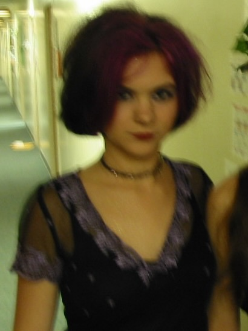

I love this mix. This is one of the most honest mixtapes I’ve ever made, recording this a month after the end of my first serious relationship and right when I started casually seeing someone new (and having *that* end a few weeks later, oh college). Yeah, typical early 20s shenanigans, but this mix captures both the endings and beginnings I experienced at this time of my life.

My very early 20s make me laugh now because I would make cryptic posts in my Livejournal about my crush and post emo song lyrics in my AIM profile.  I honestly think it’s adorable, looking back, but at the time I thought everything I went through was soooo serious and dramatic and that I’d never get through it. Here I am though, 21 years later (HALF MY LIFE AGO HOW), so far on the other side of the drama that it’s funny to remember it in 2023.

***

Want to see what I looked like at the time I made this mix? I almost definitely had this picture as my default Livejournal avatar for a little bit and even though this was me dressed up for Halloween, this is how I felt on the *inside* during this time period. *So* dramatic.

Blurry photo for dramatic effect? Check. Heavy eye makeup? Double check. My black and purple hair was *definitely* a 2002 era look!

On to the mix!

## Mix — November 15, 2002
### Side 1
1. Propellerheads, “On Her Majesty’s Secret Service”
2. Brand New, “Seventy Times 7”
3. The Dandy Warhols, “Just Try”
4. Guided by Voices, “Fair Touching”
5. Depeche Mode, “Nothing”
6. Fountains of Wayne, “Red Dragon Tattoo”
7. Old 97’s, “King of All the World”
8. Flogging Molly, “Devil’s Dance Floor”
9. Taking Back Sunday, “Great Romances of the 20th Century”
10. Self, “So Low”
11. R.E.M., “So. Central Rain”
12. Weezer, “Dope Nose”
13. Green Day, “Only of You”

### Side 2
1. New Order, “Crystal”
2. Brand New, “Last Chance to Lose Your Keys”
3. The Dandy Warhols, “The Dandy Warhols’ TV Theme Song”
4. Oasis, “The Hindu Times”
5. Ladytron, “Playgirl”
6. Buzzcocks, “Ever Fallen in Love?”
7. R.E.M., “Strange Currencies”
8. Guided by Voices, “Skills Like This”
9. Stereophonics, “Pick a Part That’s New”
10. Weezer, “El Scorcho”
11. The Juliana Theory, “If I Told you This was Killing Me, Would you Stop?”
12. The Dandy Warhols, “Nothing”
13. Travis, “Sing”

[Spotify playlist](https://open.spotify.com/playlist/3OzN7RcyaP78tok0PF130R?si=409decfa0085403b)

## Highlights: 
* I loved the SHIT out of Propellerheads in my early 20s, and I LOVED driving to the song I included here. It’s a bold move starting a mix with a 9 minute song, but even 21 old me was a bold woman!
* Like [the 2004 mix I posted a few months ago](/im-cool-enough-for-this-mix-tape-march-20-2004/), I still listen to a couple of the songs on this mix today. The Dandy Warhols will always be a fave.
* A bunch of songs I loved in high school make their appearance on this mix: Stereophonics? That super old Fountains of Wayne song? I find it interesting I included them with a bunch of bands I had just discovered, like Ladytron and Guided by Voices.
* I still love that Green Day song because it’s so cute and reminds me of early 20s feels.
* Devil’s Dance Floor is so fun and I want to get up and dance every time I hear it.

## Reflections:
* What is UP with all the Brand New?  And Taking Back Sunday? And Juliana Theory? Those did NOT age well! I alternated between laughing at the pretentiousness (and, well, creepiness) of those songs and cringing at the cheesiness of them. 
* Dope Nose? I liked that song at some point? I seriously can’t remember why I put it on this tape. Maybe I had been listening to a lot of Maladroit in late 2002? Shrug. (The Green Album was better and Pinkerton better than that.)
* So many references to calling people on the phone in these songs! It *was* the early 00s, after all!
* In hindsight, I wish I had put the Dandy Warhols’ TV Theme Song after Red Dragon Tattoo, because the latter ends with clapping while the former begins with it. 21 years later and I JUST thought of that.
* I did not listen to a lot of women artists in the early 00s and this mix totally reflects that. I'm so glad I listen to a wider variety of music now!

***

All in all, this was an interesting mix to listen to over 20 years later—this mix captures this time in my life perfectly and I’m glad I made it! Hope you all enjoyed it too.
