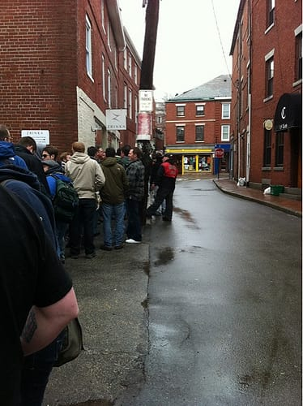
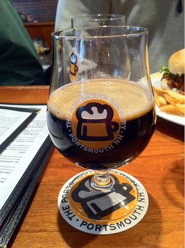
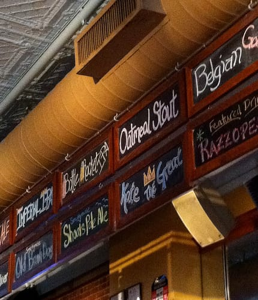

So, I kind of like beer. A lot. I love trying new beers and scoping out breweries.

My favorite brewery, however, has to be the [Portsmouth Brewery](http://portsmouthbrewery.com), just a short walk away from my apartment! This brewery? One of the best things about living in Portsmouth. Sure, [Smuttynose](http://smuttynose.com) and [Redhook](http://www.redhook.com) are good as well, but to me, the Brewery is the best.

When I first went to the Brewery to check out their beers, I started hearing about this fabled beer, [Kate the Great](http://beeradvocate.com/beer/profile/596/23030). I heard about the lines, the standing in the cold, getting up way early in the morning to get a few bottles. I very nearly went to Kate Day 2010, but I'm not the friendliest at 6am on a cold late winter morning! So I waited. I bought an Imperial Pint Club membership that fall. And was rewarded with my first taste of Kate in December 2010 at an Imperial Pint Club anniversary party.

Yes. I was in love.

This year, I knew I needed to take the day off and stand in line. Why not? It would at least be a story to tell! I knew I'd meet interesting beer geeks from all over the area and it would be a fun day.

So. 9:30am. I woke up, showered, and walked to the Brewery, only to find the line like this:

No worries. I checked my phone a bit, texted a couple people, and talked to the people in line behind me. I can text any time. Meeting other Kate enthusiasts? This only happens once a year.

So, I waited. And waited. And waited some more. The outside temperature wasn't terrible when I started waiting, but when 11:30 rolled around, I started feeling pretty chilly. I just wanted to go inside and drink my delicious beer!

At 11:45, I got my wish. Time for Kate!

I ended up sitting at a table near the front of the Brewery near the front door, apparently in the view of the [live cam](http://seacoastbeveragelab.com/kate-day-2011-live-blog) ALL day. It was kind of great. I loved my seat. I met many cool people; a few guys from Chelmsford, a young couple from Providence, some people who talked about the Decemberists and Bright Eyes over their beers... it was great. I was the only local at my table, which surprised me, though I did see a couple of my buddies (Brian of [Seacoast Beverage Lab](http://seacoastbeveragelab.com) and Twitter user [@thevandaley](http://twitter.com/thevandaley)) enjoying themselves.

All in all, a very awesome day! I brought home Kate Day shirts for both Ted and I, and we ended up picking up the bottles we won from this year's lottery system just this past weekend. We're looking forward to drinking them, whenever that will be! I'm already looking forward to Kate Day 2012!

(Note: Ted was supposed to come with me, but ended up having to work that Monday. Let's just say I drank enough Kates for both of us...)
