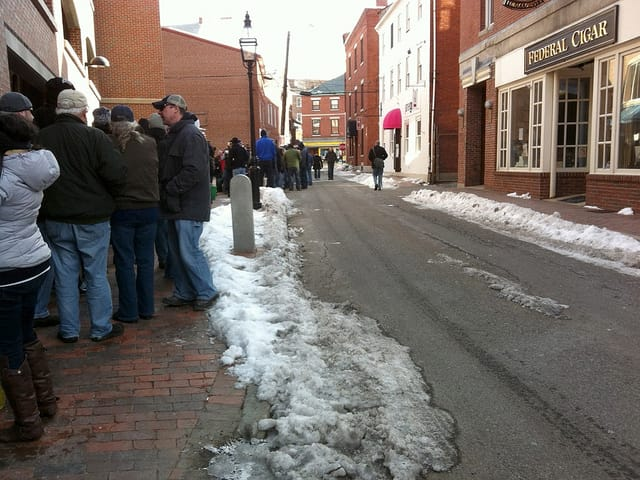
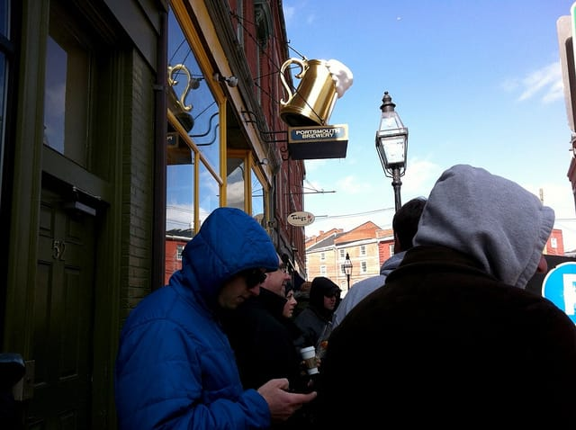
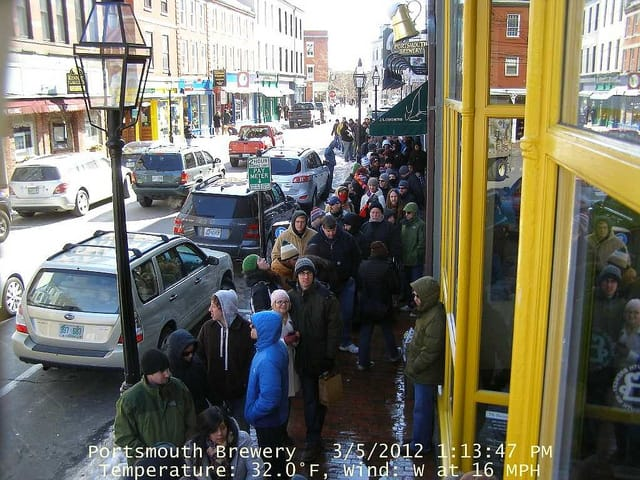
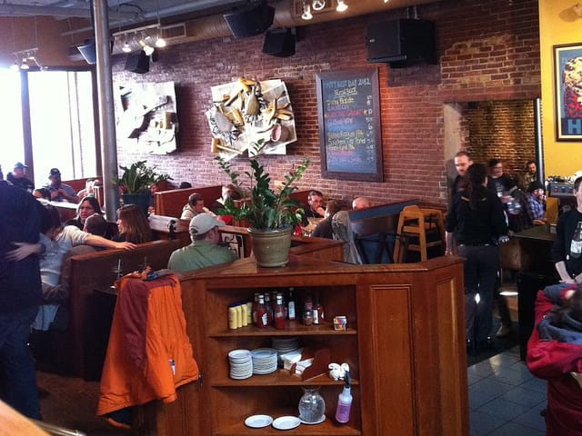
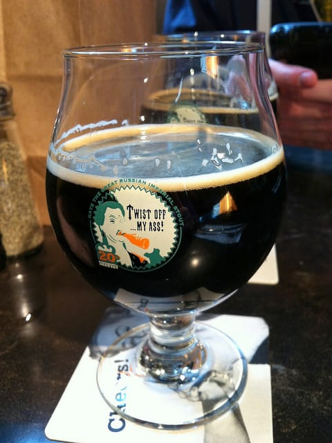
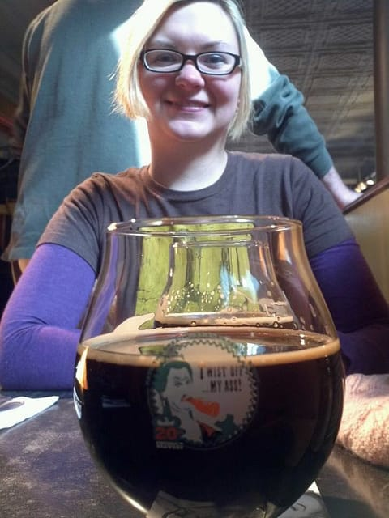

Can you believe it's been a year since [I last wrote about standing in line for a beer](/posts/kate-the-great-day-2011)? No? Well, I can't either.

Yesterday, Ted and I joined the ranks of many, many other beer geeks throughout the greater New England area and stood in line to get a taste of [Kate the Great](https://beeradvocate.com/beer/profile/596/23030), the [Portsmouth Brewery](https://portsmouthbrewery.com)'s famed Russian Imperial Stout. I stood in line last year, but this was Ted's first year experiencing the fun, crazy madness that is Kate day.

We woke up bright and early and arrived in line by 8:45am. I knew already we were in for a long wait; I was MUCH farther up in line last year and arrived 45 minutes later! I figured we wouldn't be in the first group of 250 or so that'd be let in at 11. So close, yet so far away...

You can probably tell from the picture that it wasn't exactly warm standing out there for a few hours. No, it was downright FREEZING. I had brought knitting in hopes I'd be able to get some of a dishcloth done, but no. I kept my hands in mittens the entire time and my toes kept on going numb. That's what happens when you stand outside in 25 degree weather...

As predicted, we did NOT make the initial cutoff of people being let in at 11. However, we did not anticipate having to stand outside for another TWO hours being so tantalizingly close to the Brewery entrance! I started feeling pretty miserable at this point.

Our awesome friend and beer blogger [Brian of the Seacoast Beverage Lab](https://seacoastbeveragelab.com) [posted a live blog and streamed a live webcam](https://seacoastbeveragelab.com/kate-great-day-2012-live-blog) of the line waiting to get inside the Brewery. As we inched closer to the front, we appeared on the website! We may or may not have posed for the webcam for a few minutes while we took screenshots on our phone. (I'm right behind the guy in the bright blue jacket, by the way. Pink hat, white coat. So close!)

FINALLY, a few minutes after looking at the webcam, we got in! We were seated upstairs at the topmost floor of the Brewery, allowing us a full view of the chaos below. We loved it.

We only had to wait for a few minutes before our waitress brought us our sweet, sweet glasses of Kate. The Brewery ordered special snifters for the day, which were smaller than last year's glasses. With a beer as strong as Kate, though, I didn't mind the smaller pours (8oz) this year.

I'm also thoroughly entertained by the Kate logo on the glasses. Yes.

I thoroughly enjoyed my Kate, even with a red face, messy hair, and all over coldness.

My first impression of the 2012 Kate batch? Good, but I loved the sweetness and chocolate flavors of the 2011 batch. This batch seemed a touch more bitter, which may be attributed to the fact that the beer's pretty fresh. We'll let our bottles age a bit, and we'll taste the difference when we open one up next.

Was it worth standing outside THAT long for it? Yes, but 4 hours is definitely my stand-outside-in-cold-weather limit. I fear it will be even crazier next year, so hopefully the weather will be warmer. That's the hope, at least.

And now, we wait for Kate Day 2013...
