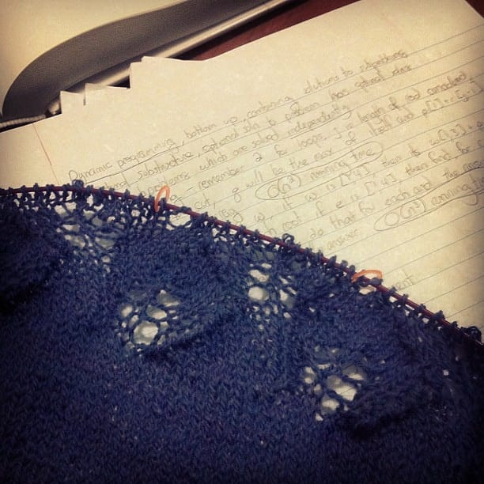

Want to see why I haven't been writing in this blog recently?

Yes, knitting and school. My final exam is tomorrow and I'm hoping the studying I did yesterday and today will suffice! I'm excited to be done with this class.

I'm also excited to have done more work on the Ginkgo Shawl. I FINALLY reached the lacy edging, and I'm about halfway through it! I'm really, really hoping I don't run out of yarn. If I do, I'll get creative. I really want to get this done before Christmas! I'll need to really start cranking this out if I want to make that deadline. Oh, Christmas knitting.

Hopefully after I finish my final tomorrow, I'll be writing here more often again.

