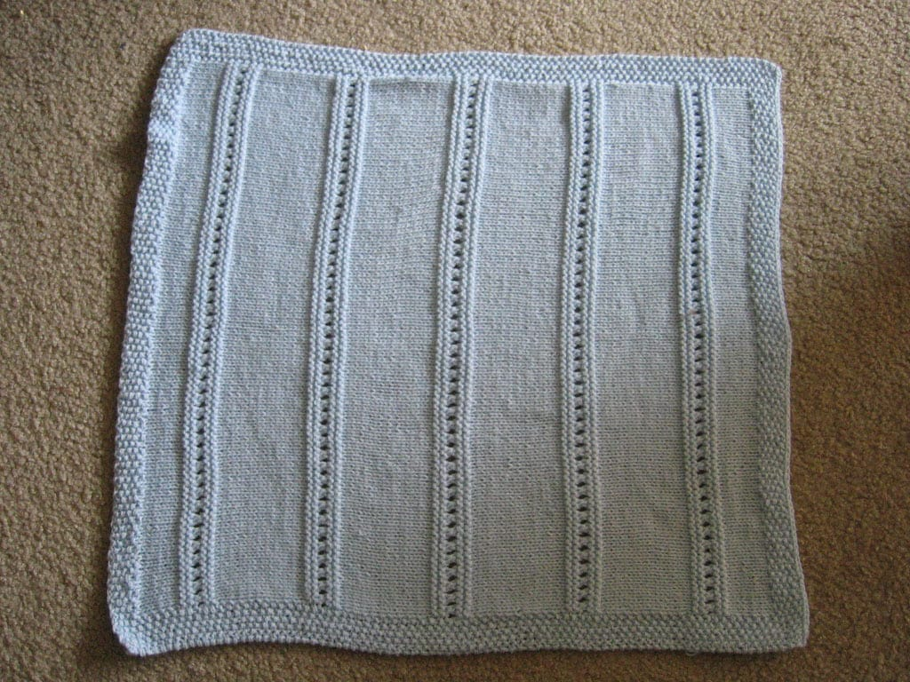
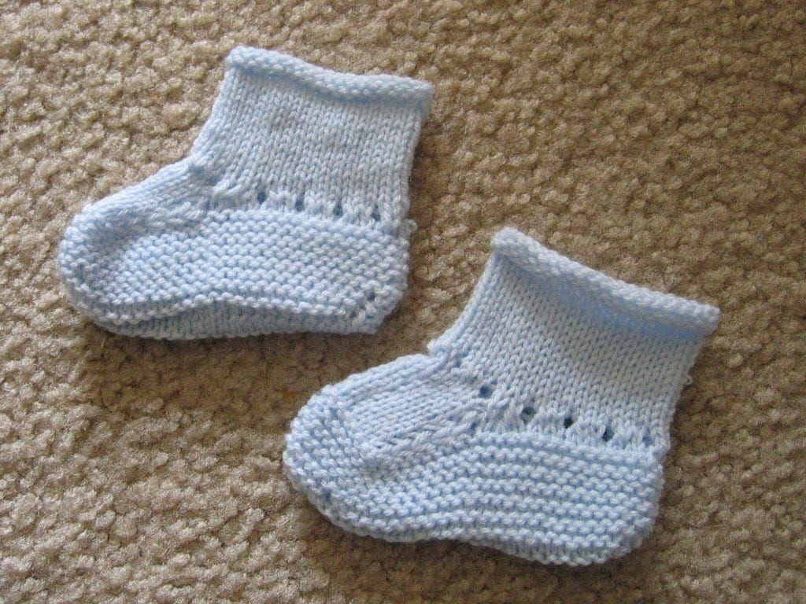
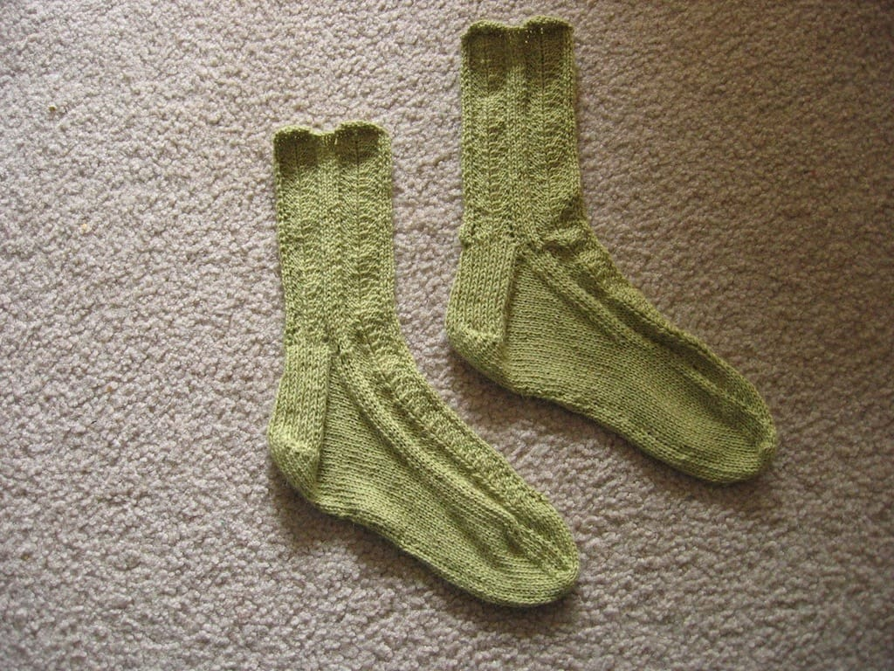
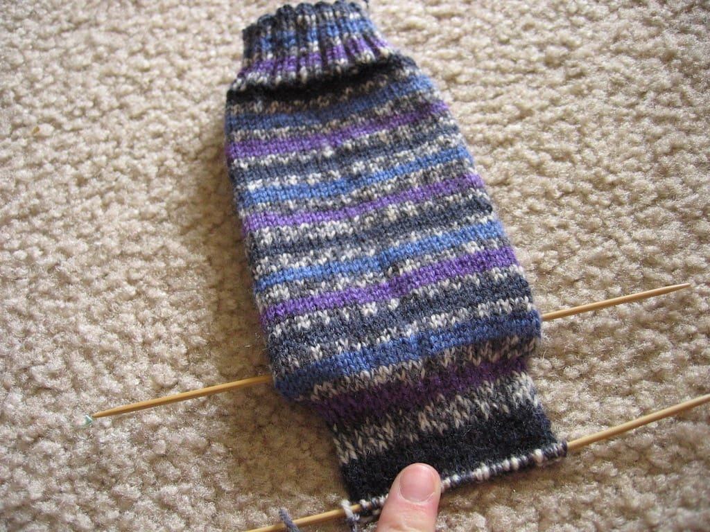
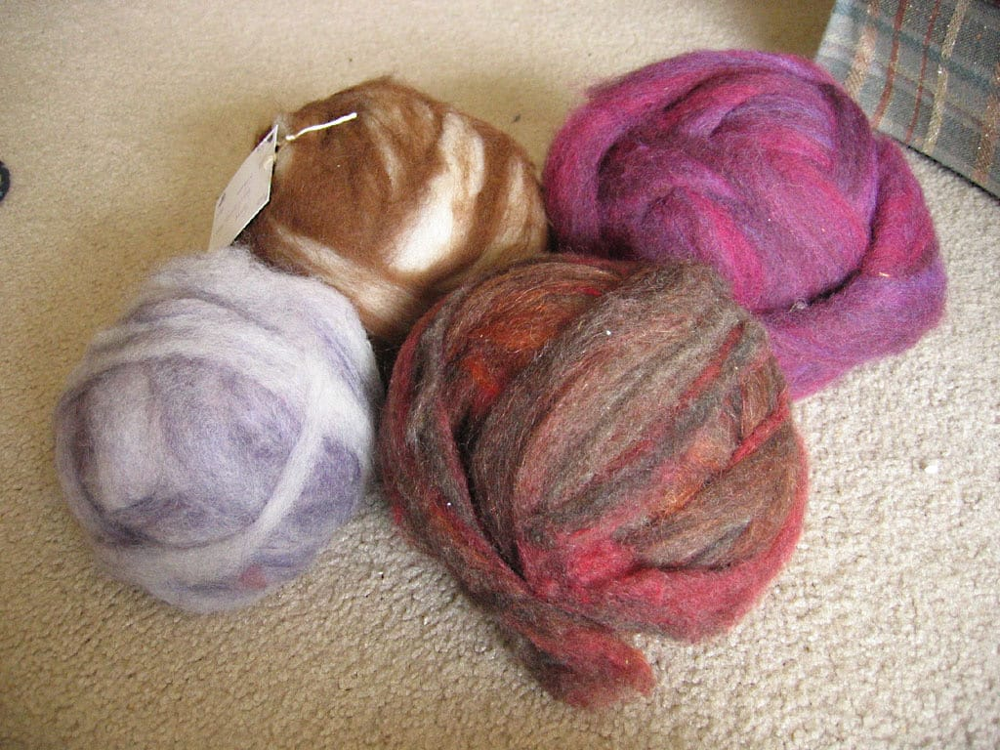
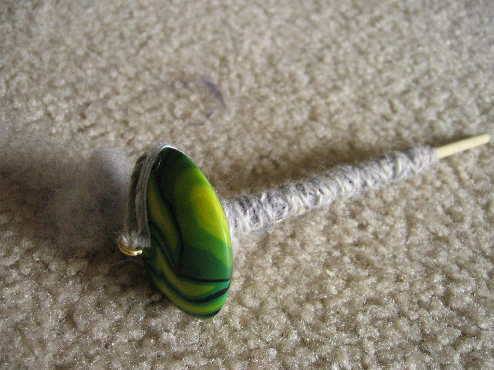
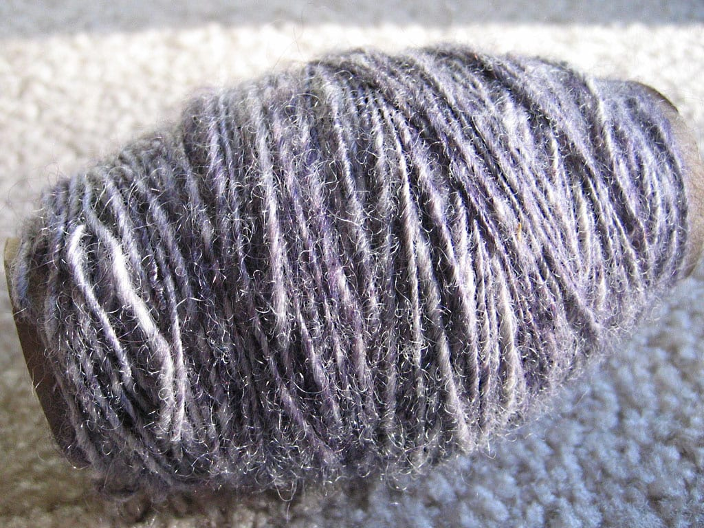

Since it's been forever and a day since I've posted any of my finished objects on this weblog, I have a massive backlog of things I've completed since the beginning of the year. Here goes!

## Blue Baby Blanket

I started this sometime in February, and I finished it a week or two ago. It wasn't the most exciting thing to knit, but I still enjoyed it. I used Plymouth Dreambaby, doubled and in blue. I really like how this turned out and I hope my soon to be born nephew likes it too!

## Blue Baby Booties

These took maybe 3 days to knit up last week. I used some of the leftover Dreambaby, single; the pattern's from a knitting day calendar I have in my office.

## Broadripple socks

These only took about a month to complete, and I love how they turned out. The pattern is Knitty's Broadripple, and the yarn's Elann's Peruvian Baby Silk in Peridot. The socks are SO SOFT; I love how they feel on my feet!

## Magic Stripes socks

I started knitting these socks back in 2004 and abandoned them after completing one. I'm using different needle sizes for this one, so it will be interesting to see how it turns out. I may end up ripping out the other sock and knitting it over if I feel like it. I'm really just doing this sock until I find another project to do.

***

This past weekend, I went to a fleece fair in southern Indiana. I came back with lots of goodies; a few balls of roving and a new top whorl spindle. I'm determined to learn how to spin correctly on a spindle.

My beautiful roving. I really, really like the magenta colored ball; I can't wait to spin that up! Clockwise from left: 6oz of purply wool, 6 oz of white and cream llama/sheep wool, 8oz of a beautiful fuschia roving, and a really gorgeous 6oz ball of wool.

Here's a picture of my new drop spindle. I bought a bottom whorl spindle a few years ago and made decent progress with it. However, I'm doing much better with the top whorl. The top's made of polymer clay and I love the funky green pattern on it! It's been much easier to spin with this spindle.

Last, but not least, here's the yarn I've spun so far! I'm spinning up my purple yarn first and I'm planning on plying it together as soon as I spin it all. I like how it's turning out so far.
