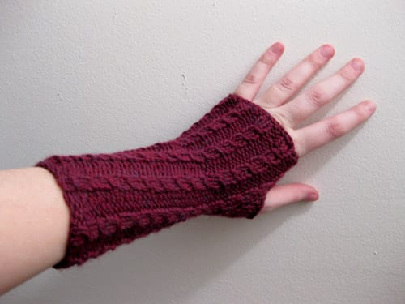
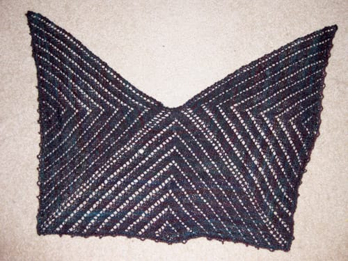

I'm finally getting around to posting some of my more recent knitting projects; I've been a knitting fool the past few months, but I have a hard time photographing the things I make. My apartment lighting is not the greatest, and when I get home to actually take the pictures, it's dark outside and the lighting in my apartment is weird. Excuses, I know.

Yes, I started another pair of [wristwarmers](/posts/hey-look-i-do-knit). A friend of mine wanted to learn how to knit on double pointed needles to make herself a pair, so I cast on for another pair myself and finished the first one in less than a week. I need to cast on for number 2 still, but I'm in no rush. I'll get them done eventually.

I also finished my [Wings to Heaven shawl](http://www.ravelry.com/patterns/library/wings-to-heaven-shawl) I started at a knitting retreat about a month ago. My friend [Vicki](http://simpleknits.blogspot.com) designed this pattern and named it in memory of a friend of ours who died of pancreatic cancer at the end of December. I loved knitting this pattern. I used some of my own handspun for this project, and I'm pretty happy with how the yarn knit up. I don't know if I can rock the shawl look, but I still enjoyed knitting this, even if I don't wear it often.

*** 

In other news, I'm heading to St. Louis this weekend to hang with my friend Laura and see the [Arch Rival Roller Girls](http://www.archrivalrollergirls.com)' first bout of the season! I'm pretty psyched to spend some time outside of the Bend as I haven't gotten out of town since visiting my family at the end of December! I've just been laying low this winter, riding out January and February and hoping warmer weather's just around the corner. I'm crossing my fingers.
