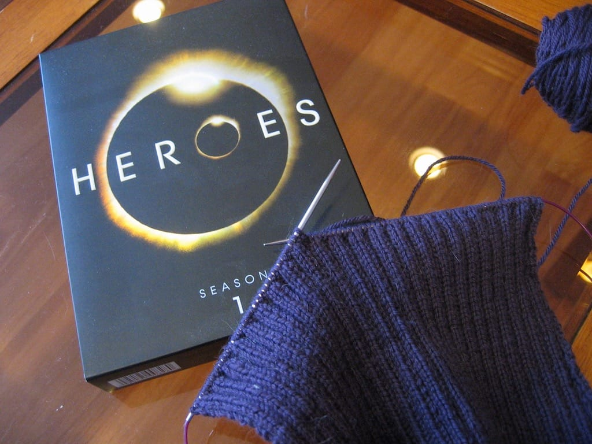
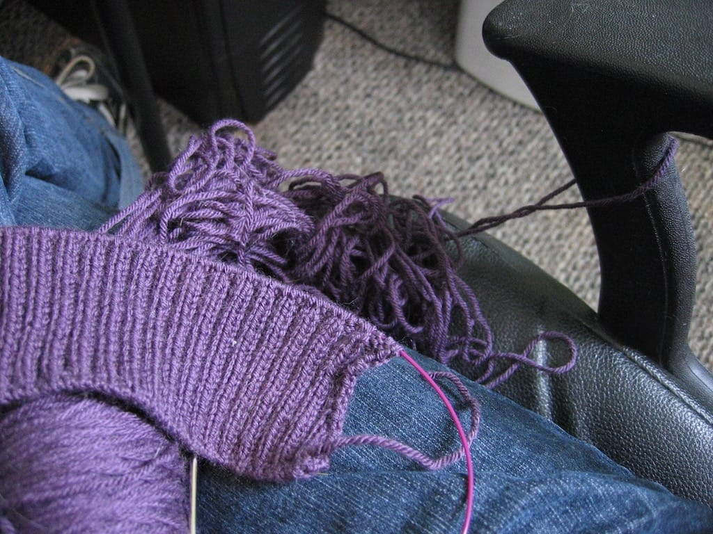

I spent the majority of this past weekend knitting one of the front panels of the [Arisaig cardigan](http://knitty.com/ISSUEfall05/PATTarisaig.html) and watching Season 1 of Heroes, which I borrowed from a friend months ago. (Yes, Josh, I'm *finally* watching the series. Finally.) We didn't do much this weekend, but we enjoyed ourselves and I felt pretty productive.

I've been working on Arisaig now for over a year. I started back in January 2007 after I bought soft purple yarn from [WEBS](href="http://yarn.com) when I visited my parents for Christmas. I love the pattern; I love the lace and I love the stretchiness of the fabric I've made. What I don't love is knitting lots and lots of ribbing on size 1 US needles. Thankfully, finally, I finished all the ribbing on the last part that needs it last night, so hopefully the last panel and the two sleeves will go quickly. I want to finish this cardigan before spring is over.

Let me tell you a story. Last week, somehow, one of my cats managed to tangle my yarn *around* my computer chair arm. Not on it, or under it; *around* it. I still don't understand. It took me all day to untangle, wind, and rewind the ball to look halfway useable, and now I've learned my lesson. No leaving knitting projects on my desk.

Speaking of computers, I went ahead and bought a laptop this past weekend. I've been talking about it for the past few months, and we set aside some money and took the plunge. I'll be able to finish my novel, surf the internet in other rooms besides this one, and bring it with me wherever I go. I can't wait for it to come in.

***

On Sunday, Scott and I went to a new restaurant a few miles from our house. We've passed it on the street many times; a nice, new looking, green and red stripey building with tinted windows, outdoor deck area surrounded by a black wrought iron fence, and plenty of parking illuminated by decorative lights around the perimeter. As we sat down, we looked at our paper menus with football themed titles for the sections ('first down' was appetizers, etc) and glanced at the shiny new flat screen TVs broadcasting the Florida - Kentucky basketball game, musing that this place must be a sports bar.

Until we heard the first few strains of "Keep on Loving You" by REO Speedwagon over the loudspeakers and glanced at the 'Live - Laugh - Love' and 'Home is where the journey begins' framed pictures on the rust colored walls which would have looked more in place at my mother's house. We couldn't stifle our laughter. We were so *confused* as to how this place wanted to present itself as a restaurant. A mid-end family eatery? A down home, local sports bar? We couldn't tell, but we enjoyed ourselves. I ordered chicken fingers with honey mustard sauce and topped it off with a raspberry cheesecake, and didn't end up eating dinner that night, I was so full. We definitely enjoyed ourselves.

***

This morning, I woke up groggy and devoid of sleep, wishing I could go back to bed. Today, at 7:30, watching the setting sun, I decided I didn't mind the coming of Daylight Saving Time.
