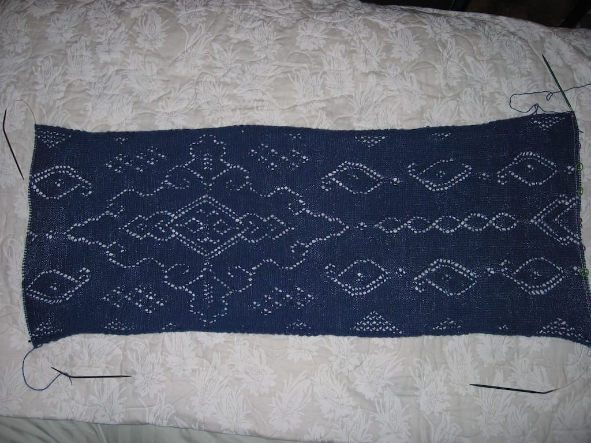
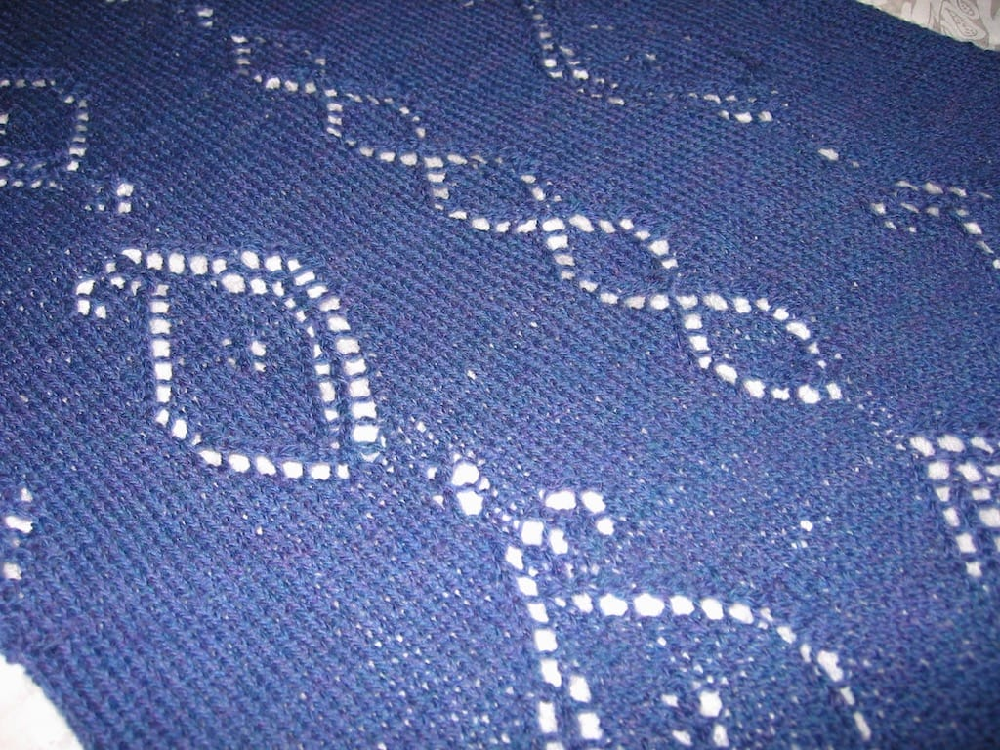
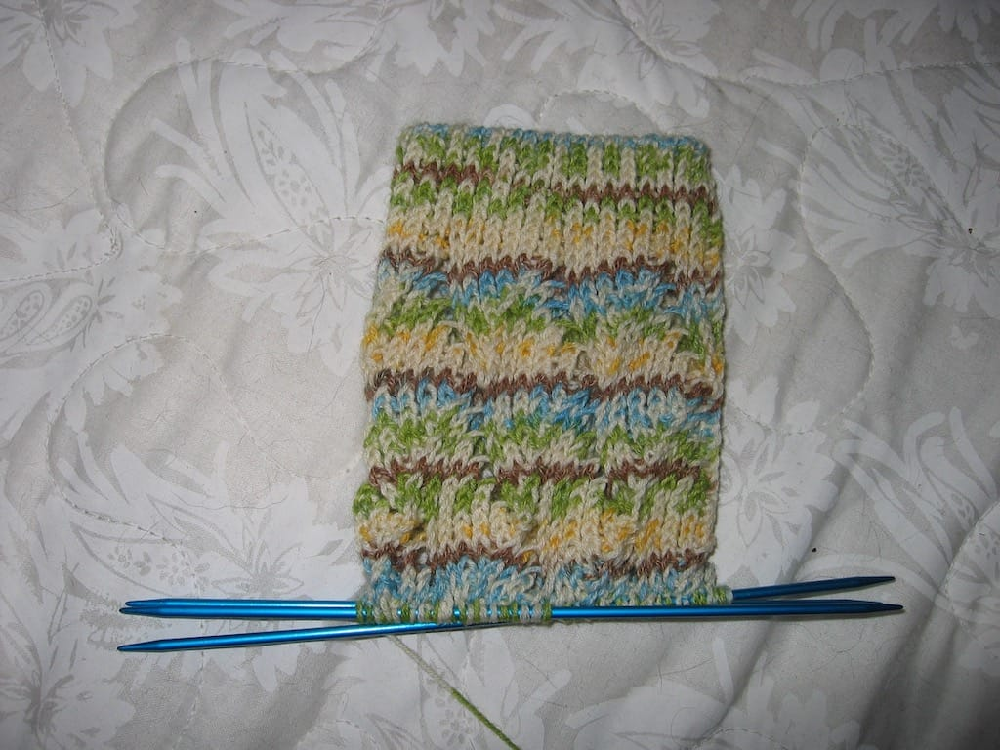

I’ve been spending a fair amount of time knitting recently, but I’ve been slacking off with documenting my progress. I finally, finally took pictures of my works in progress over the weekend, and I’m just now getting around to writing about them. Go me!

I’m cruising along with the [Mystery Stole 2](http://groups.yahoo.com/group/Mystery_Stole_2); I’m almost through part 5 (of 6) on the left hand side and only through part 2 on the right. After taking a break of about a week on this stole, I’ve been knitting it every evening after work. I’m very happy with how it looks so far, and I’m looking forward to seeing what it looks like when I finally complete it. Now that I’ve knit one lace item, I want to knit more! Thankfully I have some more lace-weight yarn in my stash I can use for my next project.

For a long time, I marveled at how I hadn’t made a mistake on the stole for about a month or so. Ha, I thought, stitch markers really have made this process a lot easier; maybe I don’t need the lifelines anyway! I never took out the lifelines I’ve been using, which made me happy last night when I counted my stitches and found I was short one stitch in one of the 10 stitch sections divided by my markers. Thankfully I only had to rip out three rows. Lesson learned; I won’t be taking out my lifelines anytime soon.

While taking a break from the stole, I cast on for [Pomatomus](http://www.knitty.com/ISSUEwinter05/PATTpomatomus.html) (which I always misspell). I really, really like the pattern so far, but I’m not sure how good this pattern works with the pattern of the yarn. I think it looks interesting, at the very least.

This sock also marks the first time I’ve ever done a tubular cast on! I really like the edge it gives me, though next time I want to learn how to do a tubular cast on in the round. With this, I cast on with straight needles and moved it to the circulars; I had to seam up one or two rows at the top because of this. It’s not really noticable, but I’d like to eventually learn how to do it right!

