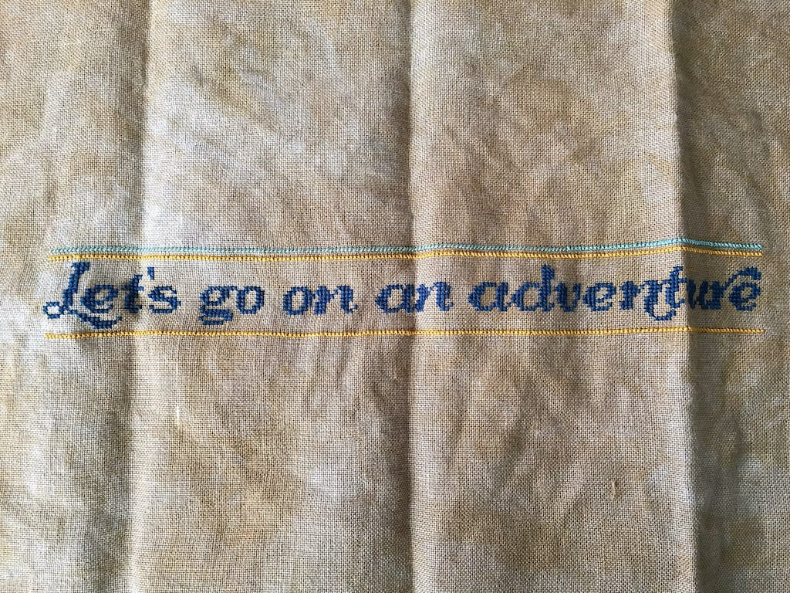
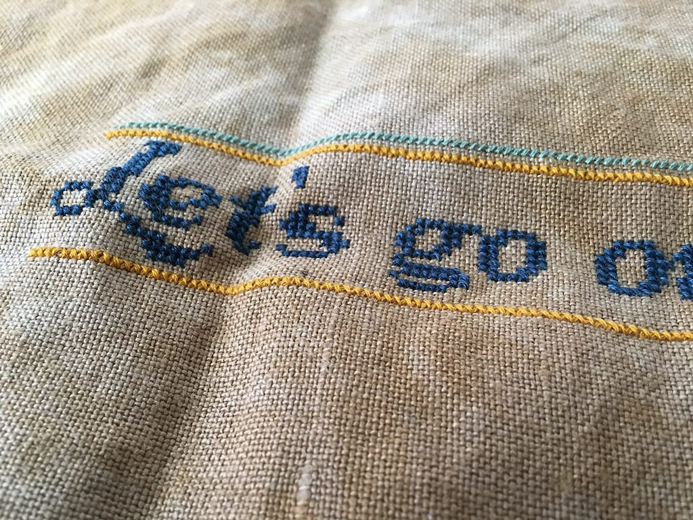
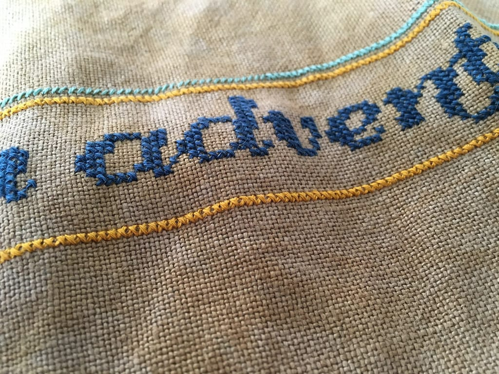

Right around the holidays, a few people I know started talking about the 2016 year-long mystery cross-stitch sampler from [The Frosted Pumpkin Stitchery](https://www.thefrostedpumpkinstitchery.com). They've done a few mystery samplers in the past, but I've never really been interested in the theme until this year, with a theme of "Let's go on an adventure". Each month I'll receive a new clue featuring a destination from somewhere around the world, and I'm excited to see what places are highlighted!

I received the first clue on January 15th, and I'll receive the remaining 11 clues on the first of each month. January's clue is a bit more substantial, as it includes the lettering and the borders as well as the first destination.

As you can see, I'm still on the lettering and borders in the center of the sampler. I'm hoping to finish them up soon so I can start on the first destination! I definitely won't finish the first clue before the second clue comes out on Monday, but I'll have plenty of time on the train next week to work on my cross-stitch. I'm looking forward to it.

I'm so happy to be cross-stitching again! And don't worry, [Harry Potter cross-stitch](/posts/a-tiny-cross-stitch-update), I haven't forgotten about you...
