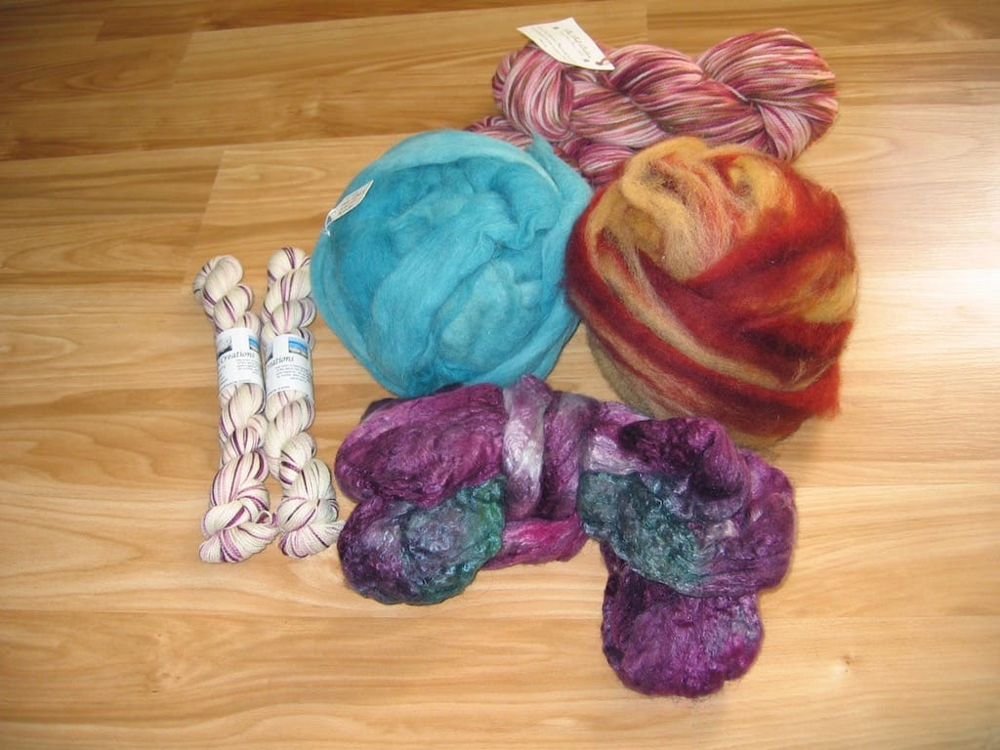

Yeah, yeah, I know I’m two WEEKS late in posting about [Michigan Fiber Fest](http://www.michiganfiberfestival.org), but hey, I’m getting around to it, at least! I’ve been too busy playing Everquest II with Scott, knitting and spinning up a storm, and spending more time off the computer to sit down and write a post about buying lots of yarn and fiber. I’d rather play with my new stuff than write about it!

Anyway. My mother came to visit me the weekend of the Fest; we had a great time going to wineries, driving around town, and just in general having a good time. I miss my family and I’m glad she came out, and she helped me a ton in answering questions about Scott’s surgery and healing process (my mother is a nurse, so she endured tons of calls from me immediately after the surgery!) She also stayed an extra day due to some issue with the South Bend - Detroit part of my mom’s flight; she was delayed the entire day so she just decided to fly out the next day instead. I felt bad, but was also glad to see her another day.

I hadn’t ever been to Allegan, the home of the Michigan Fiber Fest, so I looked up directions the night before. It seemed easy enough; drive up I-94 to I-196 and cut across. Piece of cake. What we didn’t bank on was tons and tons of construction all along I-196! Thankfully it didn’t slow us down too much, but still, what a pain. We arrived at about 11ish and ran into some of my friends almost right away, who had arrived just before we did. Success!

Much like [Sandy](http://moonlightserenade971.blogspot.com), I go through the same sort of steps when at a fiber festival such as this; I never like to buy anything right away and tend to look at nearly every booth before I go back and buy what I want. My only exception was at a booth selling worsted weight yarn at 50% off; I found three skeins of a beautiful brown/pink/melon colorway, and bought them up right away as I knew they’d be gone later on. We drooled at yarns from The Fold and we each bought a few skeins of sock yarn; I bought two skeins of Gypsy Creations yarn in the Raspberry Ripple colorway and can’t wait to knit them up!

Of course, I bought fiber as well; I didn’t buy anything on impulse, but I still loved everything I picked up. I bought 4 oz of beautiful blue alpaca fiber, a big ball of peach and red wool, and my favorite, a purply green pile of fluffy merino/silk goodness that I cannot wait to spin. I’m very excited about my purchases and happy I spent just about as much as I wanted and came home with plenty of things to keep me busy for a long time. I had a great time with my mother and friends, and will hopefully be coming back next year!
