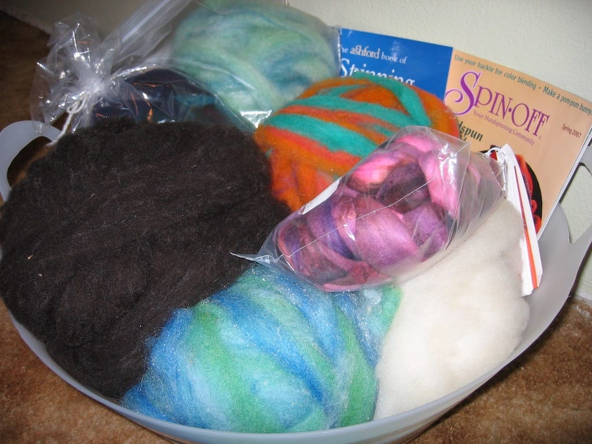

You know what’s not fun? Driving home from Chicago with an in-between headache and migraine. I can’t decide if these particular aches are migraines or not; I know that a few hours prior to the head pounding fun, my eyesight goes all fuzzy and I have a hard time seeing. I never think it’s a migraine because it doesn’t hurt nearly as much as I imagine migraines hurt, but it still throbs and causes me to not really get a lot done. I think my episode today came from the fact that I hadn’t drank any water all day and I didn’t have anything to eat until 2pm. I’m home now, drinking water and relaxing before my in-laws arrive for the weekend.

In other, much better news, my fiber arts group surprised me with a basket full of spinning fiber, books, and other spinning fun yesterday during our get-together! I’m very excited to spin up my new fiber, and I think they did a great job of picking out colors I love. [Vicki](https://simpleknits.blogspot.com) even made some of us [orifice hooks](https://simpleknits.blogspot.com/2007/04/what-ive-been-up-to.html) for our wheels and name tags to go with them; I picked a hook in red.

To [Vicki](https://simpleknits.blogspot.com), [Jess](https://clicketyclackewe.blogspot.com), [Elizabeth](https://www.esknitnspin.blogspot.com), [Michelle](https://avocadofever.blogspot.com), [Liz](https://knitandspincrazy.blogspot.com), and anyone else who may have contributed to my basket (which I will get great use of this summer, holding drinks!), thank you very much. I feel very lucky to have such fiber enablers as friends!
