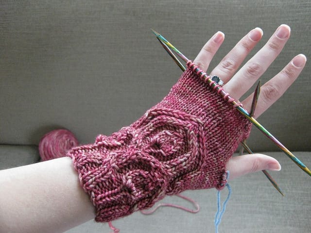
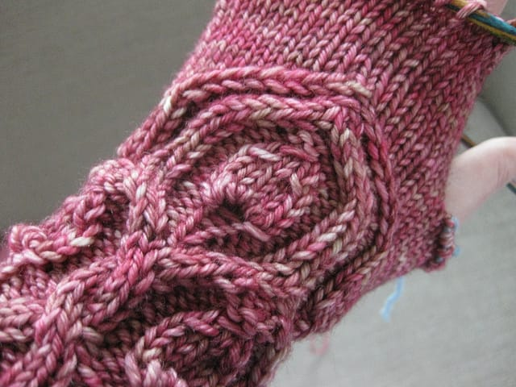

Look what I've been making!

I'm knitting a pair of [Snapdragon flip-top mitts](https://www.ravelry.com/patterns/library/snapdragon-flip-tops) by [Ysolda Teague](https://ysolda.com/) to replace the ones I knit a few years ago. Yeah, I didn't knit them that long ago, but tragedy struck last March when I moved, and I LOST one of the mitts I knit. I spent an entire year looking for the lost mitt, but I must have dropped it somewhere that isn't in the apartment. Cue sadness.

This time around, I'm knitting them in a lighter, pinker, funner yarn. I'm still using [madelinetosh tosh dk](https://madelinetosh.com/store/index.php/yarns/tosh-dk.html), but in a punchy bright pink that makes winter almost tolerable! I'm in love with them, I think. (Don't worry, I won't tell Ted.)

So far, I've made just one minor modification to the pattern; I'm using size 4 needles instead of the size 6 the pattern calls for. I knit my originals with my trusty size 6 needles, but always felt they were a little loose, especially around my wrist. The size 4s make them fit so much better.

Another noteworthy item pertaining to these mitts; I'm FLYING through them. I'm most likely the slowest knitter on the planet and I still made this much progress on the mittens in just one day. Yeah, I can't believe it either. I really, really want to get these done so I can focus on other knitting, especially that Arisaig cardigan I'm wanting to FINALLY finish. I'm confident I can do it.

