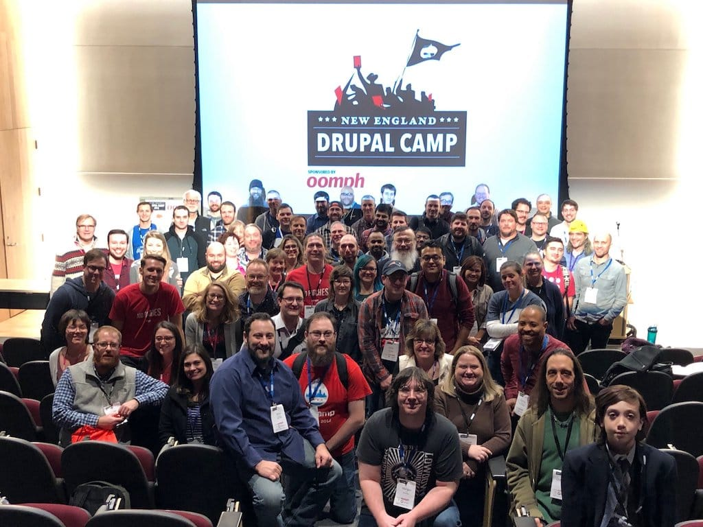
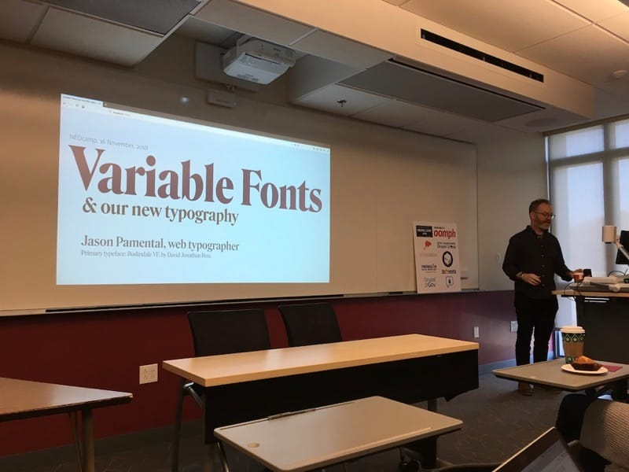
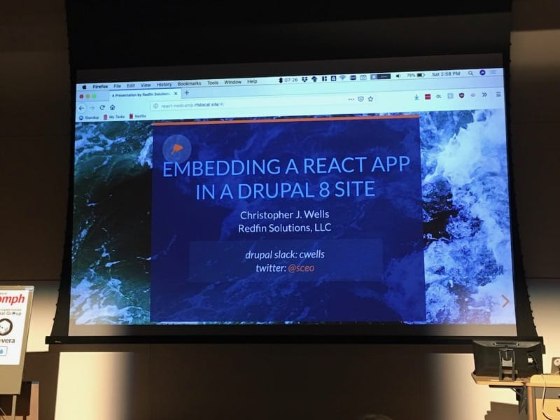

Last month I attended [NEDCamp](https://nedcamp.org), one of my favorite local Drupal camps, and I had a fantastic time! I look forward to this conference every year so I can catch up with all my Drupal-ey friends and to learn new things. I'm fortunate to be in close proximity to such a great camp.

## Camp Overview

NEDCamp's been around since 2014, when the organizers of all the local New England camps decided to consolidate all their individual camps into one regional camp. It was held in Providence in both 2014 and 2015, Manchester, New Hampshire in 2016, and Worcester in 2017. 2018 brought the camp back to Providence, and this was my first time attending the camp in this city.

## The Sessions

I attended so many great sessions at NEDCamp this year. I know to expect great talks from local Drupalists each year, and this year was no different.

### Dynamic Typography with Modern CSS and Variable Fonts by Jason Pamental

I met Jason at either Design for Drupal Boston or Drupal Camp Western Mass back in 2011, and I've been following his talks about typography and variable fonts for years. It's been awesome to see the progression of variable fonts through the years, from when they were just a twinkle in the browser's eye, to now, when they can actually be used! Jason even used 'live' variable fonts in his slides, and the capabilities continue to blow my mind. 

### Configuration Management: A True Life Story by John Picozzi and Nathan Dentzau

I recently changed jobs (surprise!), going back to the Drupal world I love so much. However, I haven't actually DONE any Drupal development for a year or so, so I needed to brush up on the basics. Enter John and Nathan's talk on configuration management. One of the things I love about Drupal 8 is the ability to import and export configuration, and since I felt a bit rusty with how to actually do this, I sat in on their session. I came away from it with renewed knowledge on best practices and how to use it. It was a great session!

### An Overview of Static Site Generators for Drupalists by Brian Perry

Obviously, I love static site generators, and Gatsby is my absolute favorite. Of course I had to attend Brian's session comparing three of them -- Jekyll, a SSG written in Ruby; Gatsby, a SSG written in React; and Tome, a SSG written in PHP using Drupal. Brian gave a basic overview of the three SSGs, giving positives and negatives for each. He clearly knew the most about Gatsby, which didn't bother me at all, because I always love hearing more about the SSG I dig the most.

### Embedding a React app in a Drupal 8 site by Chris Wells

Out of all the sessions I attended at NEDCamp, this was the session that excited me the most. I'm starting to enter the world of decoupled Drupal applications and the world of React, and Chris explained how he and his team at Redfin Solutions integrated a React app into a Drupal 8 site. This is the area of Drupal I want to explore more thoroughly because I love JavaScript and want to integrate that love into my other love, Drupal. It's a match made in heaven.

### Nobody wants a website. They want results! by Dwayne McDaniel

This session went way out of my comfort zone! Dwayne talked about sales goals and project management solutions when it comes to clients and websites. It's not a side I usually see, being a developer not really involved with the client process. It was interesting to hear Dwayne's perspective and to hear what the others in the room had to say about their experiences. I'm glad I sat in on his session so I could hear the opinions of people involved on the business side of things.

* * *

All in all, NEDCamp ruled. I learned new and interesting things from the excellent sessions I attended and I got to catch up with my local Drupal friends. If you are in the New England area and do Drupal development, you should be attending this camp. If you don't live in the New England area and do Drupal development, you STILL should be attending this camp. The quality of speakers and the friendliness of the local Drupal developers make this camp an excellent one to attend for everyone.
