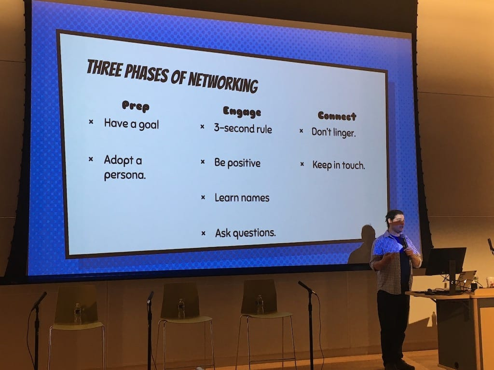

This past weekend, I attended [NEDCamp](https://nedcamp.org), a camp I've been attending for the past 4 years. As always, I enjoyed the camp and all the fantastic sessions. This year [I presented a session of my own](https://nedcamp.org/sessions/2019/putting-c-back-css-modern-techniques-todays-website), and I think it went pretty well!

NEDCamp was held in Providence, RI again this year, so that worked out well for Adam and I! A couple of our friends drove us down from Boston and we got stuck in some not so fun traffic, but our great conversaions made up for it. We grabbed dinner at the hotel and spent the evening touching up our sessions for the next day.

## The Sessions

### Drupal 8 &amp; Gatsby JS: What, Why &amp; How by Zachary Weishar

Even though I no longer use Gatsby to power my site, I still enjoy going to talks about decoupling Drupal. This was a nice overview of what you gain and lose by decoupling your Drupal site, so this session's a great reminder of the plusses and minuses of using Gatsby as your front end.

[Read more about the Drupal 8 &amp; Gatsby JS presentation on the NEDCamp site.](https://nedcamp.org/sessions/2019/drupal-8-gatsby-js-what-why-how)

### Media in Drupal 8: everything you need to know by Adam G-H

Adam gave a fantastic talk on Media in Drupal 8! He explained the complexities of the system in a clear and concise manner. He used diagrams to explain one of the more complex parts of the Media system, and a couple people near me said they understood the system better and could now talk to their clients about why Media in Drupal 8 is useful. I'm so glad I finally got to see him present at a conference.

[View the slides from Adam's talk!](http://slides.com/phenaproxima/d8media#/)

### Building Meaningful Network Connections by Mike Miles

I always enjoy Mike's talks because they are so organized, with clear takeaways and important points. Mike outlined three different phases of networking: prep, engage, and connect, and listed a couple different action items for each phase. I found it helpful as I always like to brush up on my networking skills!

[View the slides from Mike's talk!](https://docs.google.com/presentation/d/1tmnKhmA3TZyV0aFpKQcrIIu-_N9WxbY2qj0ruPirL28/edit#slide=id.g35f391192_00)

### Keynote - The Three Circles of Digital Care by J.D. Flynn, Matt Westgate, and Dori Kelner

This year's keynote? **Amazing.** I absolutely loved that the camp organizers chose Being Human as the topic this year. The keynote opened with a personal story by John Picozzi and the fantastic display of empathy his employer, Oomph, demonstrated when his wife was in the hospital. That kicked off a fantastic panel of people in the Drupal community, answering questions both from the moderator and the audience. I'm glad my local Drupal community values being human and recognizes that

### Putting the "C" Back in CSS by... me!!

Hey look, it's me! I first presented this talk at Design 4 Drupal earlier this year and was asked to fill in at NEDCamp after a cancellation. I'm glad I got to deliver this session again! I talked about why the cascade is still important today and gave a general overview on BEM and Sass and ways to use them together. I hope everyone who attended enjoyed the talk and learned something new!

(At some point I'll post my slides, but today is not that day.)

### From Squiggles to Straight Lines: Sketch to make decisions and get on with it by Marissa Epstein

Marissa's talk ruled! I loved hearing her speak about her processes as a UX designer and how she puts pen to paper to visualize her ideas. Her talk made me want to start sketching out my ideas and to sketch out any notes I take at conferences or meetings! I enjoyed attending a talk that wasn't about code or development and I hope to see more talks from her in the future.

[View Marissa's slides and read more about her talk on the NEDCamp site.](https://nedcamp.org/sessions/2019/squiggles-straight-lines-sketch-make-decisions-and-get-it)

### Advanced Techniques With Layout Builder by Nathan Dentzau

Nathan presented to a full house during the last session of the day, and it was a great talk! He went over ways to enhance Layout Builder's built-in functionality, including filtering the massive list of blocks, adding background colors and images to sections, and even incorporating modals instead of the settings tray! It was pretty cool to see all the things he wrote to add to an already fantastic module.

[See code samples from Nathan's talk on Github.](https://github.com/nathandentzau/layout-builder-examples)

---

After the conference, we attended the after party for about an hour. I ate a ton of delicious bacon wrapped scallops (one of my favorite parts about this camp every year!) and chatted with a few people. After the party we went out to dinner with a bunch of people from the conference, and at about 10pm, we got tired and walked back to the hotel. We fell asleep pretty quickly after a fun and knowledge-filled camp!

I had a great time at NEDCamp, as always! I look forward to this camp every year and I can't wait to attend NEDCamp 2020.
