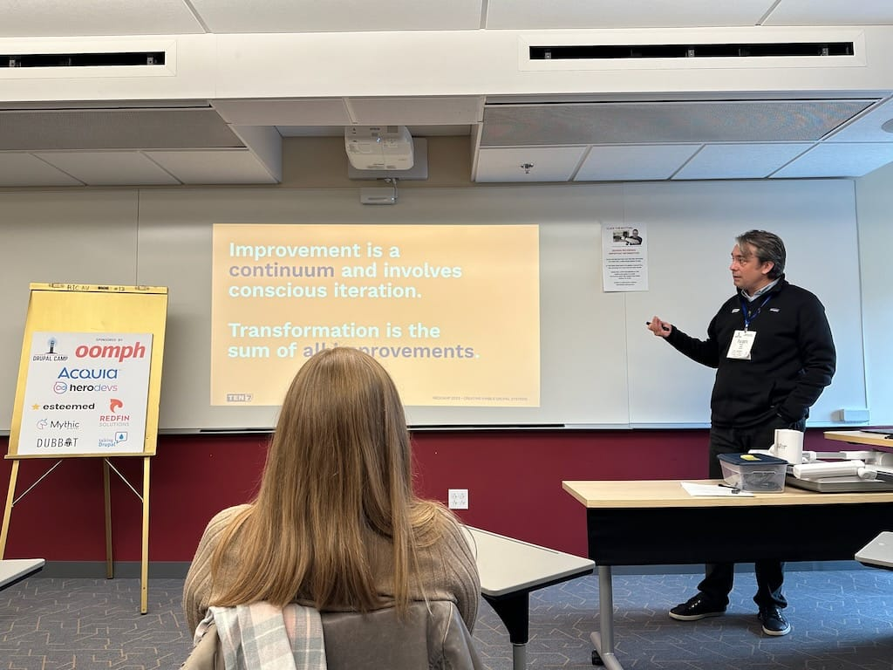
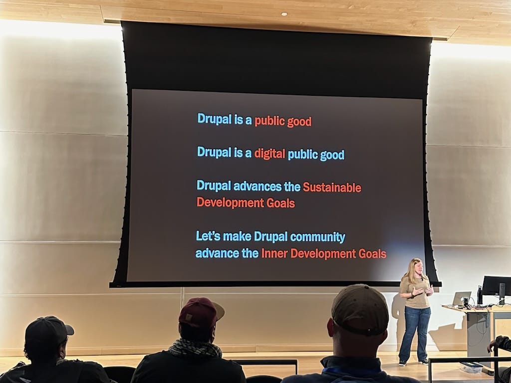
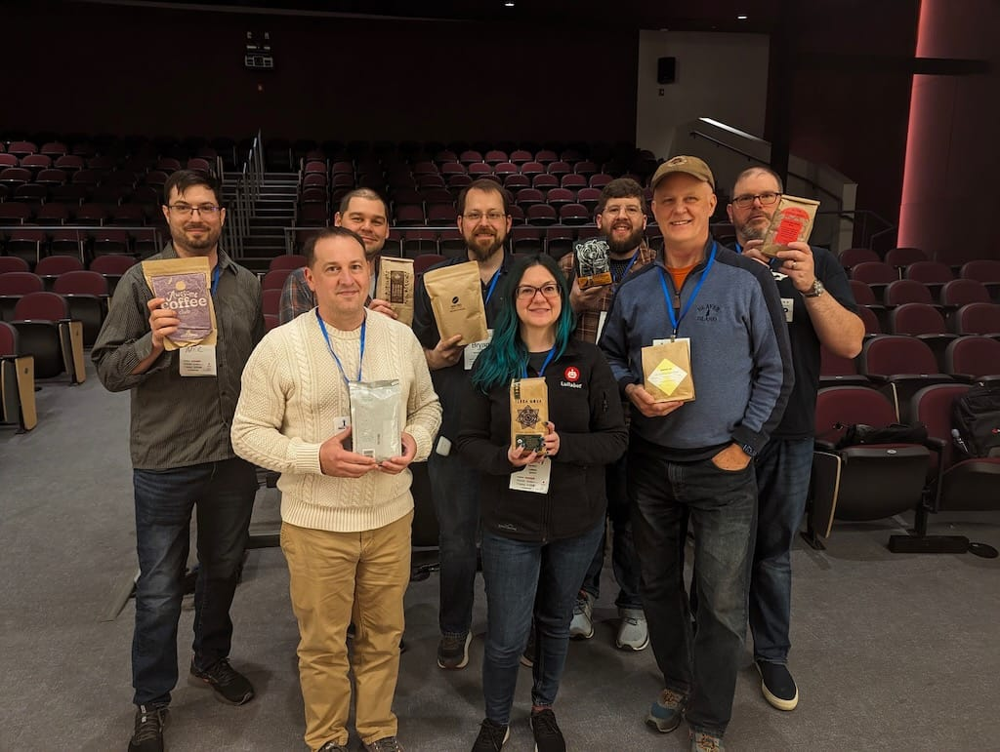
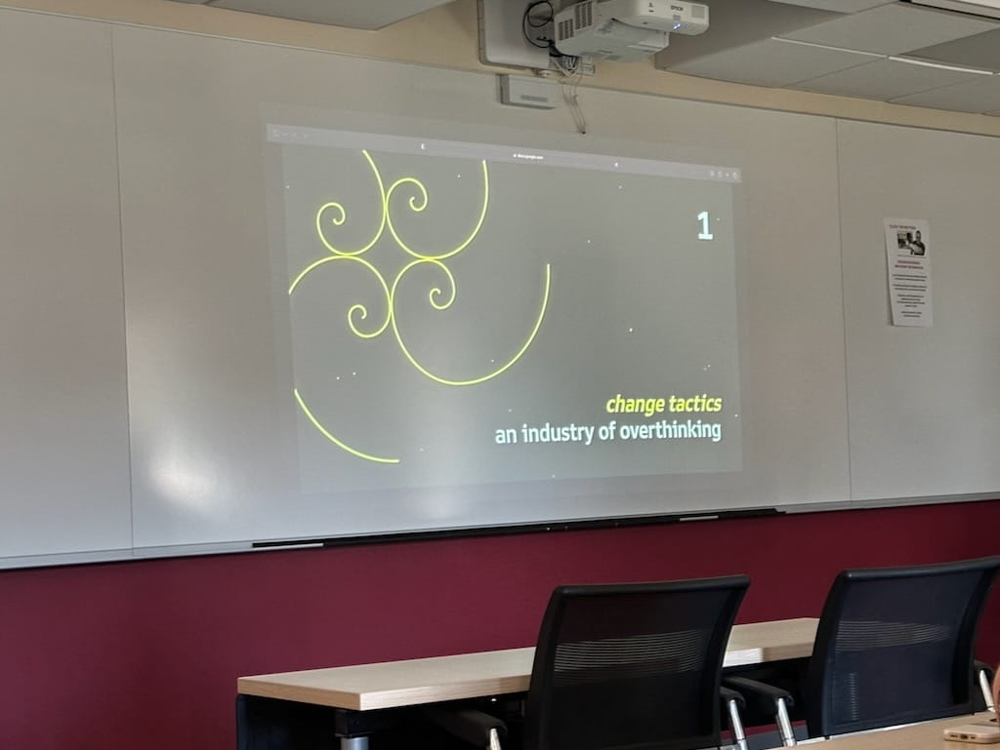
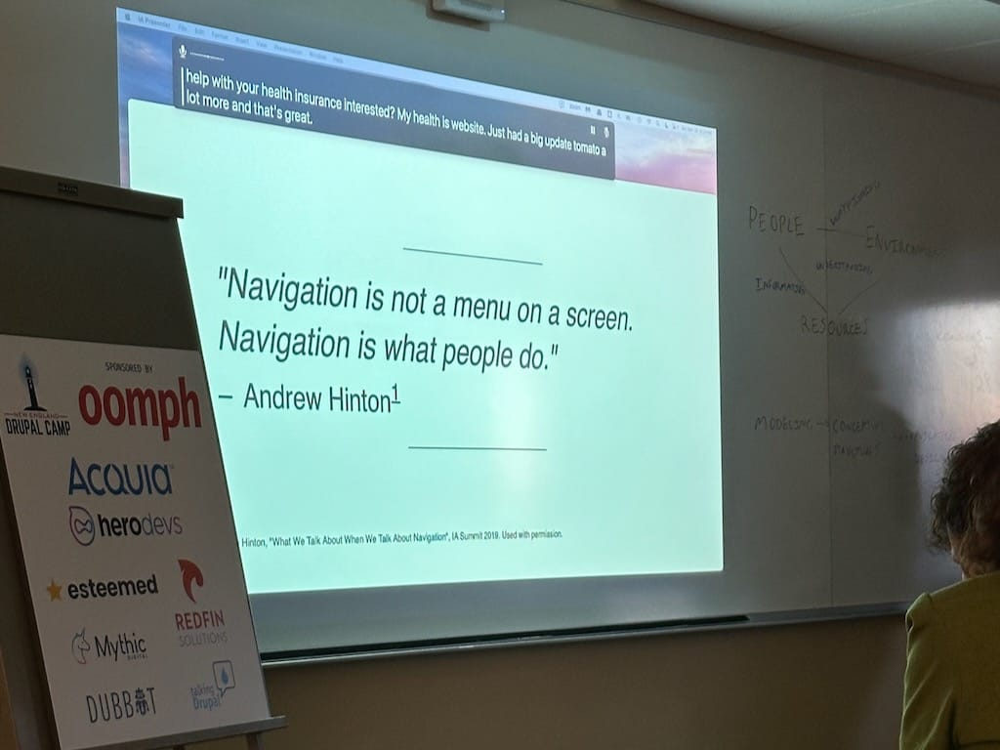

Another year, another NEDCamp in the books! This has been one of my favorite camps and not only because it’s local, but also because of the quality sessions. I’ve been attending this camp since 2016 and have even written a [couple](/nedcamp-2018) [posts](/nedcamp-2019) about previous camps. It was a whirlwind trip for me as I spent only a little over 24 hours in Providence, but I had such a good time.

## Pre-camp
I drove to Providence on Friday afternoon. I thought leaving at 2:30 would help me avoid any dreaded Mass Pike traffic that always seems to materialize on a Friday afternoon, but alas, the hour and a half drive to Rhode Island took me 3 hours. Thankfully the weather wasn’t bad, at least! 

I finally arrived at the hotel at 5:30, checked into my room, then ventured down to the lobby to meet up with some of my fellow Drupal buddies. I attended the community social just a short walk away from the hotel, and I chatted with a bunch of old friends and new people. Went to dinner with some fellow Lullabot colleagues and ended the day with a nightcap at the hotel! All in all, a fun evening and a great way to start the camp!

## The sessions
As always, I attended a bunch of quality sessions. I decided to switch it up a bit and attend non-technical talks and I’m so glad I did! Here’s what I attended this year:

### [Do You Still Need Sass in 2023?](https://nedcamp.org/sessions/2023/do-you-still-need-sass-2023) by me!
Yes, I spoke during the first slot of the day! I thought my talk went pretty well—I talked about new things in native CSS, how to use PostCSS, how you can use modern CSS today even while using Sass, and of course I talked about if you still needed Sass in 2023. Want to know the answer? You’ll just need to [watch my talk](https://www.youtube.com/watch?v=xAb7K_zL9OQ)! 

### [Creating Nimble Drupal Systems: Transforming a Drupal Team in 6 Months](https://nedcamp.org/sessions/2023/creating-nimble-drupal-systems-transforming-drupal-team-6-months) by Ivan Stegic

I loved hearing Ivan’s story of how he and his team built a Drupal site for a state government in 6 months and the challenges they faced in discovery, migration, user experience, and accessibility. We build a lot of sites for state governments at Lullabot, so this was an interesting session to learn about how other teams accomplish a site build in 6 months.

### [Keynote: The Inner Work of Being a Public Good](https://nedcamp.org/sessions/2023/keynote-inner-work-being-public-good) by Whitney Hess

This was such an interesting keynote! I knew a little about Drupal becoming a digital public good earlier this year, but I loved learning more. She talked a little about the UN’s Sustainable Development Goals which I knew a little about from my current client at work, but it was interesting to learn more about these goals and about the Inner Development Goals framework to identify skills to help drive change. 

### [Drupal Coffee Exchange](https://nedcamp.org/sessions/2023/drupal-coffee-exchange)

One of my favorite parts of any Drupal Con or Camp, I love exchanging coffee with fellow coffee snobs! I brought a bag of coffee from a local roaster in the Berkshires, and I came home with a lovely blend from a roastry in Keene, NH. I can’t wait to try it!

### [Debugging Yourself: How to Move Forward When the Blocker is You](https://nedcamp.org/sessions/2023/debugging-yourself-how-move-forward-when-blocker-you) by Nichole Addeo

This session hit me *hard*. Nichole talked about getting in her head about work and what career she should take, feeling like an impostor, and feeling like nothing felt *right* to her, job-wise. Yep, I’ve been there! I nodded along as she talked about figuring it out and knowing that strength comes from within. I really loved this talk.

### [Designing Human-Centered Navigation: Information Architecture Principles for structuring a website](https://nedcamp.org/sessions/2023/designing-human-centered-navigation-information-architecture-principles-structuring) by Dan Zollman

This talk was absolutely out of my wheelhouse and it was so interesting because I don’t deal with information architecture on a day to day basis! I loved Dan’s example of trying to figure out how to get health insurance from the health connector in Massachusetts, something I’ve had to do in the past and struggled with. I really want to learn more about information architecture and this is a good session in which to start!

***

At the end of the day I attended the afterparty, which consisted of my favorite appetizer of bacon wrapped scallops and local Rhode Island beers. After some food, a drink, and great conversation with other Drupalists, I drove home, making much better time than I had on Friday night. Thanks for another great year, NEDCamp, and I can’t wait for NEDCamp 2024!
