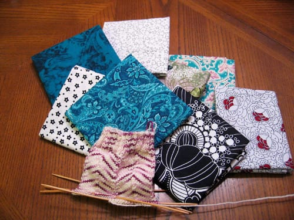
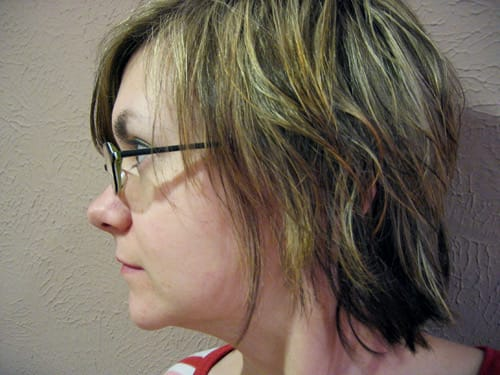

This weekend, I randomly went to Kentucky. I also spent an insubordinate amount of time in a car, driving the interstate between Louisville and Cincinnati, happily gazing outside the windows to see mountains much like the mountains near my hometown in Massachusetts.

Scott's mother, our sister-in-law, and Scott's aunt embarked on a trip across southern Indiana and northern Kentucky on Saturday for a shop hop; the three of them purchased 'passports' from one of the shops, then had to get the passport 'stamped' at eight different shops in the area. *Eight.* I was along for the ride during round 2 of the hop, which took me to five different shops throughout the area. I was interested. I like driving around a state I had only been to twice prior; once to Louisville about five years ago, and again to help his grandfather move into his old apartment a few years ago. I love new states.

I knit. Everyone knows I knit. What everyone does *not* know, however, is that I quilt. A little. Scott's mom taught me how a few years back and got me a basic sewing machine for Christmas that year, but I haven't devoted much time to it so far. I have a few quilting books, even, and I've put together a few tops. She said I did a good job for not having done it before, and I had a good time figuring things out. I think I like quilting because of the mathematical parts; measuring, fitting things together, finding a way to put the pieces together. It's like a puzzle, somewhat.

But now I want to do more quilting. I saw some patterns I liked (how could I not; I did go to five different quilt shops, each with their own assortment of quilts adorning the walls, of course I'd find a pattern or two I liked!), and I'm pretty sure I can improvise a pattern and figure out what I need to do without buying a book. It's pretty fascinating, the art of cutting up fabric and sewing it back together in patterns. I always liked geometry and tesselations as a kid, and I do have a minor in mathematics, so it's no surprise I'm drawn into quilting.

I believe I'm going to attempt the [365 project](http://www.flickr.com/groups/project_365) again. I tried taking a picture of myself once a day back in August and again in October, failing after about thirty days both times. This time, I hope to take pictures every day, even if I loathe the photo immensely. I want to stick with it.
