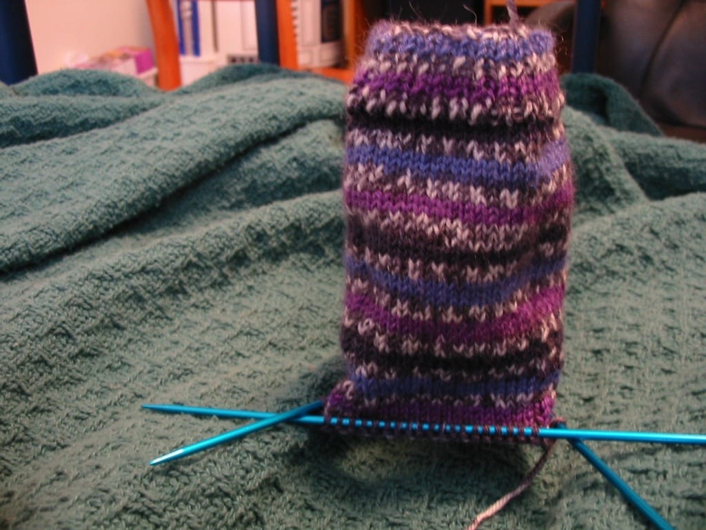
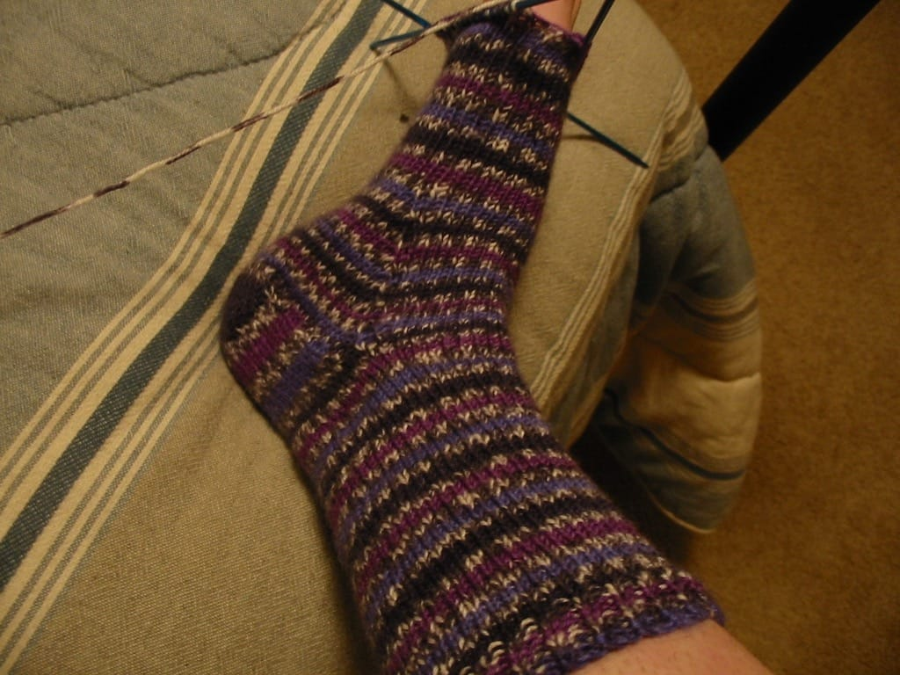
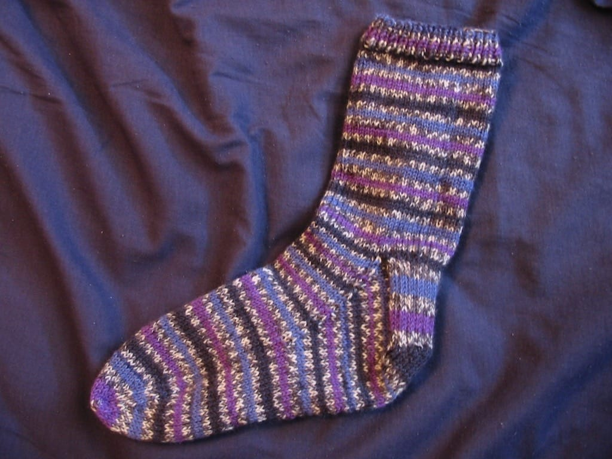
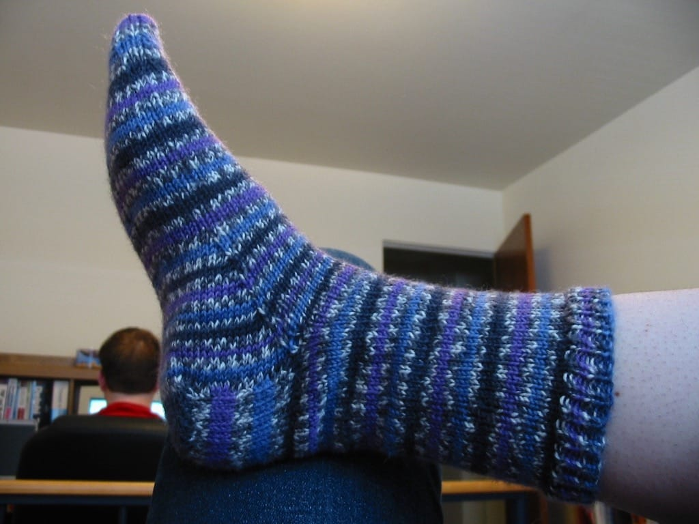

I am bad. I’ve been working on a pair of socks for a week now, and no pictures.

But wait.

I have taken pictures, but I haven’t posted them.

Until now.

Behold!

Last weekend, I journeyed to the store and bought a skein of [Lion Brand Magic Stripes yarn](http://www.lionbrand.com/cgi-bin/lionbrand/index.fcgi?page=http://www.lionbrand.com/yarns/magicStripes.htm) in the purple pattern, and a set of 4 size 2 DPNs for making the sock. I started the sock immediately after I returned home, as I couldn’t wait to start.

I’ve found that making socks isn’t hard at all, like I thought it would be. I knit the cuff with no problems, then played around with the needles a bit to start the heel. I turned the heal with no problem, and the only thing that seemed confusing to me was how to pick up the stitches to start the gusset. I think I did it correctly, then began decreasing fun.

Yesterday, finally, I came to the final toe decreases, nearing the end of the sock. More decreasing ensued, and it came time for the part of the sock that worried me the most - the grafting. However, the Magic Stripes sock instructions came with a detailed explanation of grafting, and to my surprise, **I had no problem with it.** I am so pleased with my grafting skills!

So… one down, one more to go! I’m going to take a break from knitting and focus on getting that CMSAL completed sometime before the next one starts (in May). I really love how this sock looks, and I’m looking forward to making many more pairs in the future!
