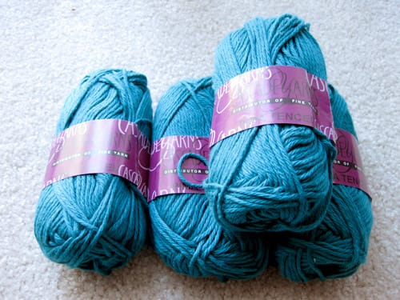
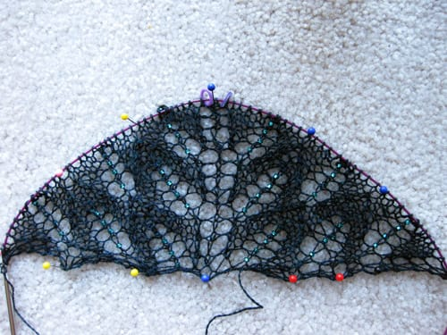

Finally, *finally*, spring has arrived. Sort of. The temperatures have been averaging in the upper 40s / lower 50s, which I can stand much much more than the below freezing temperatures we endured all winter. I'm so glad winter's mostly behind us. Until today, when I woke up to SNOW FALLING. Come on, weather, give me a break! I'm so done with freezing temperatures and white stuff falling from the sky. Sad.

Anyway. A few weeks ago I traveled to nearby Goshen to visit [Ewe-nique Knits](http://www.ewe-niqueknits.net/), a yarn shop [Madalyn](http://lettucepieces.com/unravelme)'s raved about since I've known her. So, I hopped in my car, drove out to Goshen, and spent some time petting skeins of yarn. Yes, I love yarn. I ended up buying four skeins of Cascade Pima Tencel in a deep teal color; I'll probably use it for baby sweaters of some sort, eventually. I fell in love with it, and it's so silky and shiny too! 

And, of course, I stopped by Dunkin Donuts for a coolata on my drive back; Goshen is one of the few places with a Dunkin Donuts in northern Indiana! So I was reminded of driving to Cape Cod on my half hour trip back to South Bend.

The new [Knitty](https://knitty.com) came out a few weeks ago; I sorted through the new patterns while on my lunch break at work. And then, I came across the [Aeolian Shawl](http://www.knitty.com/ISSUEspring09/KSPATTaeolian.php). Now, I'm normally not the kind of person to impulsively cast on a project immediately after seeing it. I've always been more conservative when it comes to starting projects. Oh, not this time. I immediately queued it on Ravelry, and when I got home that evening, cast on for the swatch. I decided on using the [Knit Picks](http://www.knitpicks.com) [Alpaca Cloud](http://www.knitpicks.com/Alpaca+Cloud+Lace+Yarn_YD5420108.html) in Midnight that I bought for a shawl last year, with the same green beads I used for it.

***

I have not been posting here very much this spring; I've been so busy! I cannot believe it's already April. I cannot believe that next month it will be May. I don't know where the last year has gone, seriously. I am hoping to write more this spring and summer, and I hope I actually stick to it this time.
