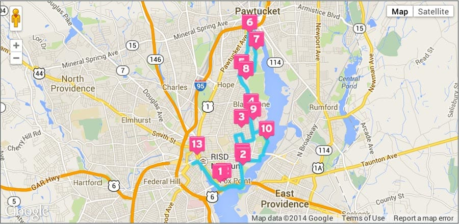
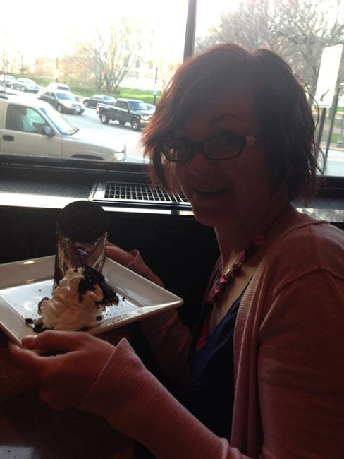
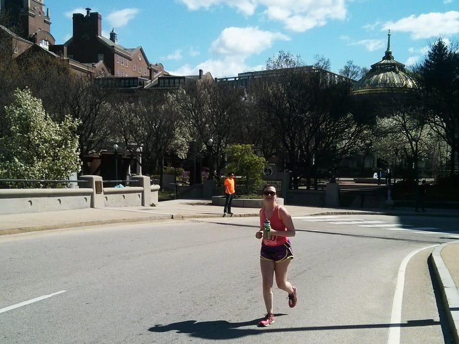
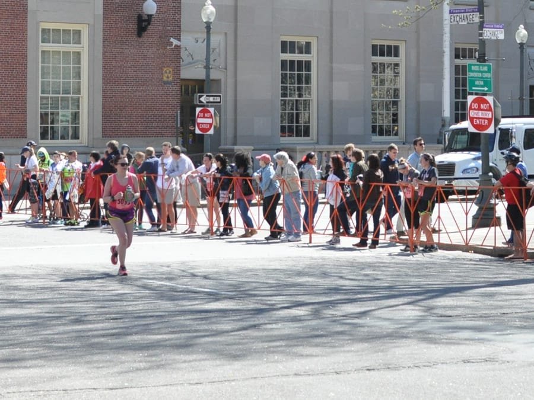
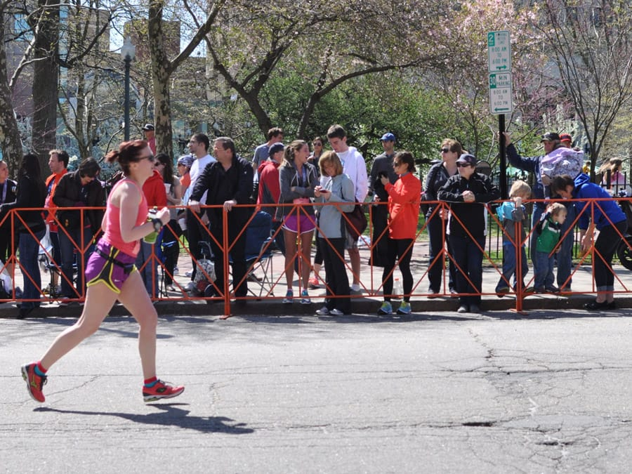
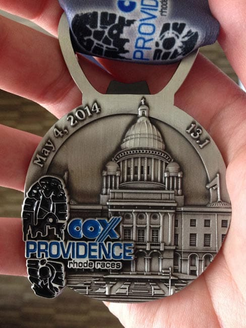
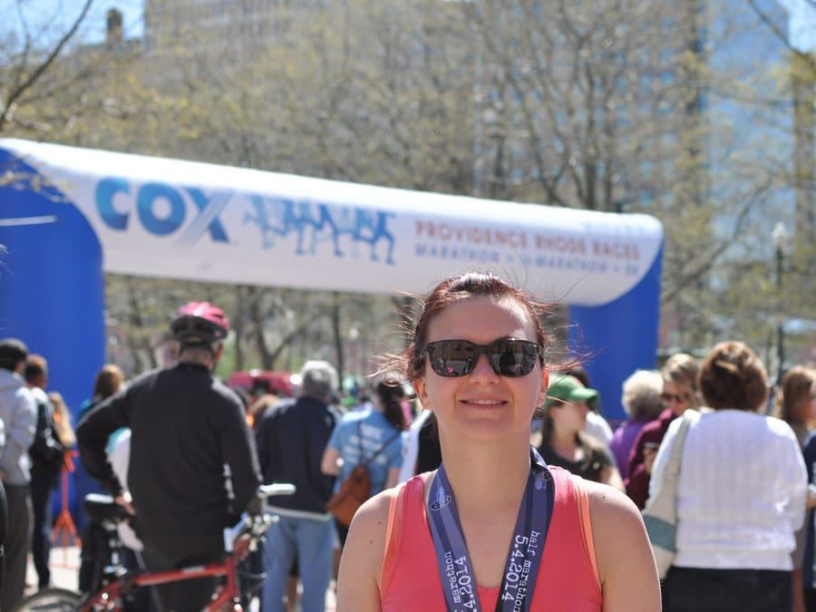

Yesterday, I ran the [United Healthcare Providence Half Marathon](https://rhoderaces.com), my very first half marathon. Even though I put in the training and hit all my long runs, I *still* can't believe I did it.

## The weekend

Ted and I drove down to Providence on Friday to spend an extended weekend in the city. Neither of us had ever been to Providence, so we were excited to see what we could find there! After a few stops on the way, we made it down to Providence at around 3:30.

After checking in, I picked up my bib at the expo, then we did some exploring! Our hotel was also attached to the [Providence Place Mall](https://www.providenceplace.com), so we wandered around there for a bit. This mall was HUGE - Apple store, Cheesecake Factory, PF Changs - we don't have any of these at the mall here in town! We ended up eating at PF Changs that night and Cheesecake Factory with my sister and brother in law on Saturday night.

 

We also found a few cool places to eat and drink outside of the mall! We went to [Trinity Brewhouse](https://www.trinitybrewhouse.com) for beers on Friday, and for lunch on Saturday we ate at [Veggie Fun](https://www.veggiefunri.com), a vegan Asian place. I'm a huge fan of vegan Asian food, so of course I really dug this place! We also went to see Aziz Ansari perform some comedy on Saturday night, which really helped loosen me up for the race. He is hilarious.

## The race

I felt really nervous on Sunday when I woke up at 6am. I had been sick the past couple weeks with some sort of cold that attacked my sinuses, leaving me with a stuffy nose that *wouldn't go away*. Thankfully, I finally started feeling better the weekend of the race! Whew!

The morning was a blur. I ate my breakfast of an english muffin with butter and a banana, put on a tank top and shorts, and paced around the hotel room waiting for the start. I worried a bit about chafing, as I hadn't worn the shorts or the tank top since last year, so I liberally applied Sport Glide in all my chafable places and hoped for the best. I didn't run into any chafing problems during the race, which made me happy.

Finally, I made my way to the start. I got pretty emotional as we started moving. After deciding not to run my first half due to injury, this one meant more to me. After all my training, all my preparation, finally, I was going to run my first half marathon. I couldn't believe it.

**The first few miles** alternated between feeling pretty good and feeling like a chore. I kept on thinking, "Holy crap. I'm going to be running for HOW long? No way can I do this." but I put one foot in front of the other, and somehow made it through the first 5k.

**Miles 4-6** felt great. We started running through a park area and I decided to take water and Gatorade at every stop, just to avoid overheating. This was a fantastic decision because the heat didn't bother me much at all. Also, I ate my first package of Honey Stingers at mile 5, and that kicked me back into gear for the next few miles.

**Miles 7-9** weren't bad, but not as great as 4-6. I plodded along, we entered Pawtucket, and we turned around to head back into Providence! We ran back through the park and heard many people cheering us. I gave a little kid a high five and just kept going. I felt strong.

**Miles 10-13.1** were the *worst*. I've only run 10+ miles twice prior to the half, and both times, I started really hurting around miles 10-11. It also didn't help that the last couple miles contained some hills, which I really didn't want to hit right at the end of the race! We ran a lot by the water during the last couple miles, which was nice except for the screaming winds! I started to really struggle, and it felt like the miles would never end. I was so happy to see the 12 mile sign.

About a quarter mile before the finish, I rounded the corner to see Ted! This perked me up a bit and gave me the energy to power it up to the finish. I kept on telling myself, "Only 3-10ths of a mile left, only 3-10ths of a mile left".

 

Finally, at long last, I rounded another corner and saw the finish line looming ahead!

 

Even though I hurt a bit, I still felt good enough to crank it up for the last .1, so I used up the rest of my energy to power my way to the finish line.

I crossed the finish line at **2:18:42**, a time I'm very proud of. I was hoping to finish by at least 2:30 and was wondering if I could do 2:15, but I'm pretty happy with my time. Volunteers gave me my medal right as I crossed, and I wore it with pride.

After picking up some Gatorade, water, and a Clif Builder's bar, I made my way to my sister, her family, and Ted, and we chatted a bit about the race. My legs and feet HURT at this point, and I really wanted to sit down. I felt so happy that my sister and her family came to watch me run, and I'm happy she took so many great pictures of me at the finish!

I absolutely *loved* my first half marathon experience. I am so proud of myself for not only finishing, but pretty much running it the entire time, barring the 5 seconds or so that I walked through each of the 4 water stops. I am really, really sore today, but I'm happy I had the foresight to take today off work so I can just relax! Now, I'm going to spend the rest of the day thinking about my experience!
