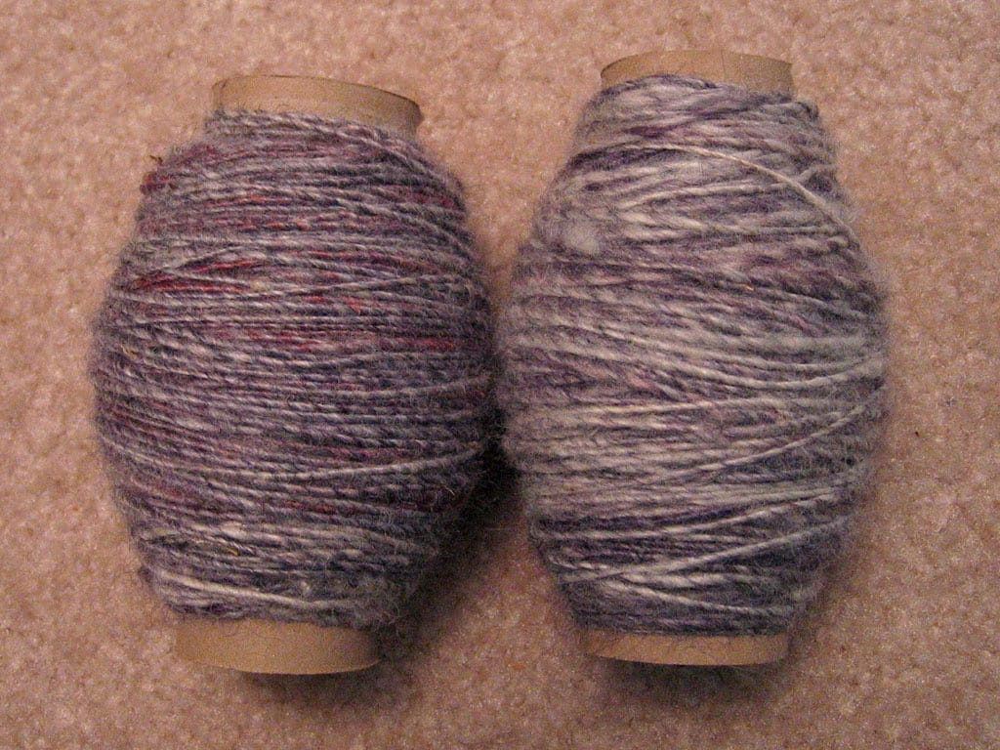

I'm proud of myself; I've finally spun up around 6oz of purple roving I bought last weekend, and it looks halfway decent!

It's taken me roughly a week to spin this up; I started it last weekend at our monthly knitting guild meeting, and finished about a half hour ago. The difference of quality between the two is definitely noticeable; guess which one I spun first?

Now, on to plying. I've read somewhere that plying with a bottom whorl spindle is ideal, but yeah, I'm not entirely sure I want to try with it. I don't want to risk ruining my beautiful yarn, but I know I can't walk around with half-finished yarn on toilet paper tubes for the rest of my life. Maybe I'll read up on things before making it beautiful, but knowing me, I'll jump right into it and hopefully figure it out. Homespun yarn I can actually knit, here I come!
