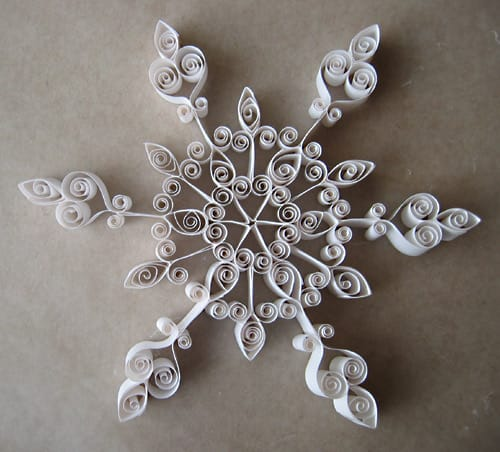

A few weeks ago, I learned a new craft; quilling. It's not difficult at all; it involves creating shapes by rolling strips of paper around a thin stylus, then piecing them together to make shapes, flowers, whatever one wishes. Obviously I bought a kit for creating snowflakes, and I whipped up three flakes in no time. I'm looking forward to hanging them from our Christmas tree this year.
