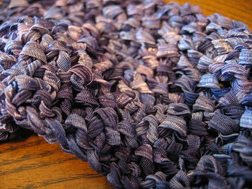

I've begun work on the [Ribbon Xback](https://knitty.com/ISSUEspring05/PATTxback.html) tank. I bought a few skeins of [Lion Brand Incredible](http://www.lionbrand.com/yarns/incredible.htm) in 'Blue Shades' and so far, knitting with a ribbon yarn has been an experience. I love the color of the yarn; the graduated blue and purple colors will go great with my hair color when I complete it. The top's done completely in seed stitch; I thought alternating my knitting and purling would be a chore but so far it's been moving along pretty quickly. I'm hoping to get this done sometime soon, but I don't allocate enough time to knit.

Either way, I'm pleased with this. I need to watch more TV so I can knit more often!
