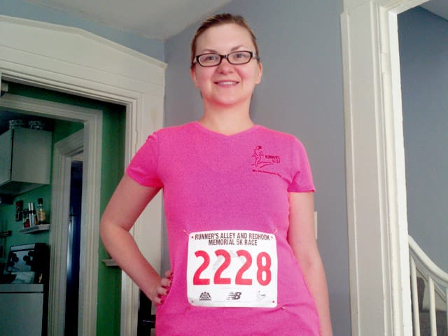
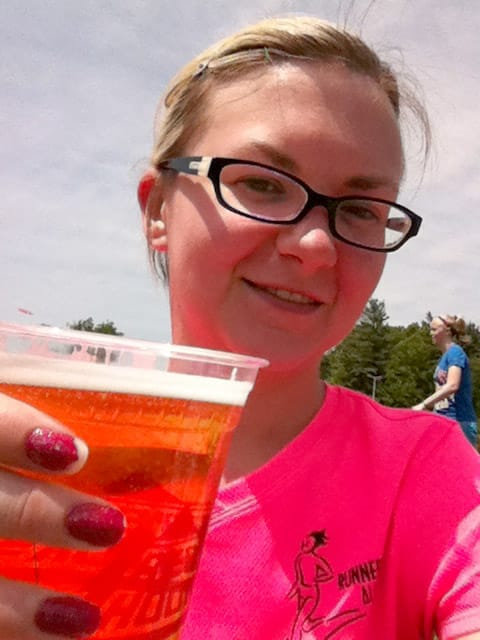

So, I [ran a 5k](https://www.runnersalley.com/redhook.html) yesterday!

Words can't describe how great I feel after the race yesterday. Crossing that finish line was one of the best feelings *ever*, and I'm proud of myself for being able to run 3.1 miles without giving up. Seriously, today's race has me PUMPED and ready for more!

I discovered I **LOVE LOVE LOVE** running with so many people on the road at the same time. LOVE it. I love reading people's funny shirts, hearing bits of music from other's headphones, and listening to others encourage each other to keep it up and keep on going! I also kind of loved people cheering for us on the sidelines. Talk about motivation!

I loved it so much that I didn't even compare myself to the other runners around me (Am I running too slow? How's my breathing? OH NO that stroller is going faster than me!), so I rocked the first mile and didn't have to stop to walk until after the first mile marker. This made me happy. I felt strong the next two miles, too, though I had to stop to walk for 15 second intervals a few times. I started getting tired at the end, but I made sure to reserve some energy to run to the finish!

Oh, the finish. As soon as I rounded the corner, people cheered me on! I started feeling very nauseous as I was finishing, but I focused on the line in front of me and running to the finish. I felt SO proud of myself as I crossed the finish line. SO PROUD. Ted finished a few seconds after me; he rocked his, as well!

* **STATS**
* Place: 1525/2038
* Division: 283/398
* Time: **35:04** (YAY!!)
* Pace: 11:17

So, not the fastest run ever, but still. It's **MY** fastest run ever. A few months ago [I couldn't run **ONE** mile](/posts/born-to-run), much less 3.1, so I'm proud of myself.

After we finished, we partook in the goodness that is free beer (after pounding a whole lot of water, of course). Oh, yes. We definitely earned this beer today.

I am SO EXCITED about running. I want to go and sign up for ALL THE RACES now. Seriously. I'm looking forward to running many more 5Ks this summer and hopefully sign up for a 10K this fall! I'm very happy with how I did and look forward to doing even better in the future!
