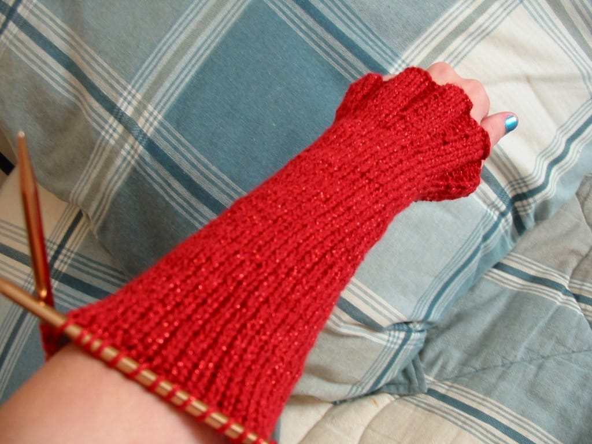
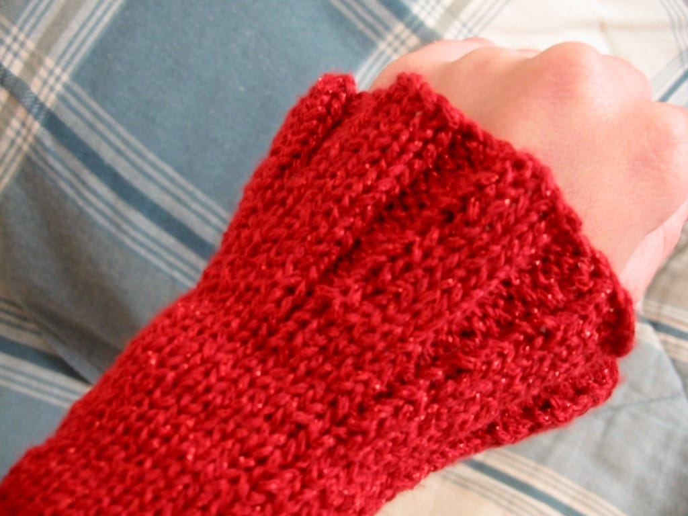

*Shimmer* has been a chore so far, I’m telling you! I tried completing the back piece first, but after tearing it out twice (the second time I had been nearly finished!) I decided to do the arms first. I’m happy that I did; they seem to be taking a lot longer than I thought they would, though they look pretty cool. I’m especially happy about the flared cuffs; I’m happy they’re turning out well.

I’m still only on the first arm, and I’m hoping to finish it sometime tomorrow and start on the second. I decided to use a new method of casting on this time, one that looks better on ribbing; *the double cast on*. It took me awhile to get the hang of it; I had to find pictures online and flip them in Photoshop so I could do the stitch the lefty way. (I really wish a book on left-handed knitting existed!) However, I’m very pleased with the edge the cast on left me, and I’m even happier with my *Shimmer* progress!
