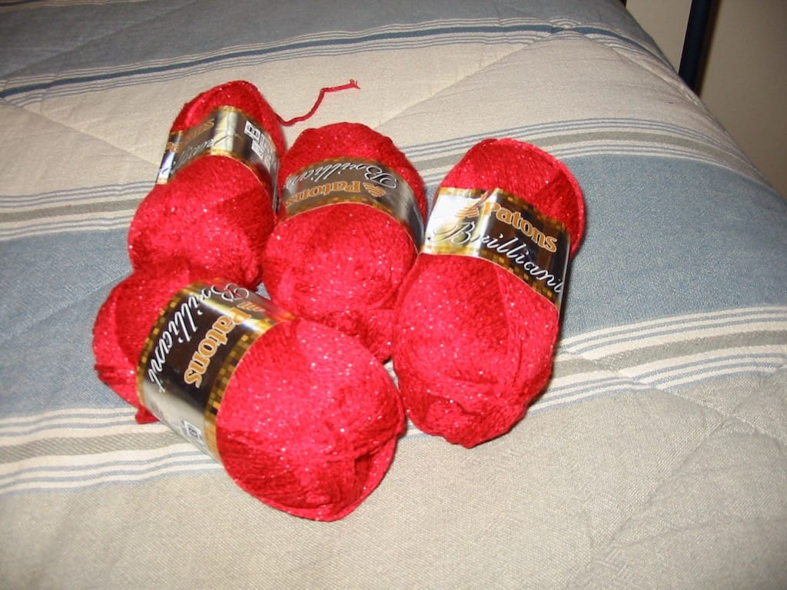

I’m happy; I’m *knitting* again! Ever since last winter’s [Knitty](https://knitty.com) came out, I’ve really wanted to try my hand at [Shimmer](http://www.knitty.com/ISSUEwinter03/PATTshimmer.html), a pretty sparkly shrug that seems to be just my style. However, I never wanted to spend the exorbitant prices for [Lion Brand Glitterspun](http://www.lionbrand.com/yarns/glitterspun.htm) yarn; it sells for about 8 bucks in all the major knitting stores, and most LYS’s don’t dare carry it. I had been keeping tabs on Glitterspun prices for months by tracking online stores, but sales on the yarn never occurred. I gave up, eventually, and put my knitting on hold while I pursued other interests.

Early last week, I surfed the archives of the [Crafty Log](http://crafty.imbri.org) (where I also post!) and came across an entry by [Jaye](http://blog.wingedorange.net) about [a glittery top she knit](http://crafty.imbri.org/archives/2004/05/09/sparkly-top) out of a yarn called [Patons Brilliant](http://www.patonsyarns.com/product.php?LGC=brilliant), which she described as a ‘Glitterspun knockoff’. I remembered seeing the post when she wrote it months ago, but had forgotten about it until I read the entry again! Of course, I was ecstatic; perhaps this yarn would be cheaper and easier to find online than Glitterspun!

That very afternoon I started searching online for stores that may carry the yarn, and one of the first online shops I stumbled across, [Beehive Wool](http://www.beehivewool.com), not only carried the yarn, but at a price of **$3.99** per skein! Overjoyed, I ordered the yarn; unfortunately, since they are located in Canada, I had to pay a 7 dollar shipping fee, but still. 26 bucks for 5 skeins of high quality yarn is *not* a bad price! I sat tight after ordering, hoping that the yarn would come in sometime within the near future.

Beehive Wool gained more points in my book yesterday when my yarn arrived in the mail! I did not expect it to arrive so soon; I had been hoping to recieve it at the end of the week at the earliest, and to have it arrive on a Tuesday afternoon made me so much happier. I eagerly opened the package to take a look at the yarn, and as I thought, it looks and feels *exactly* like Glitterspun.

Eee! I’ve started on *Shimmer*, but I have yet to take a picture of it that I like. I need to learn more about taking indoor pictures in an area with a limited amount of lighting.
