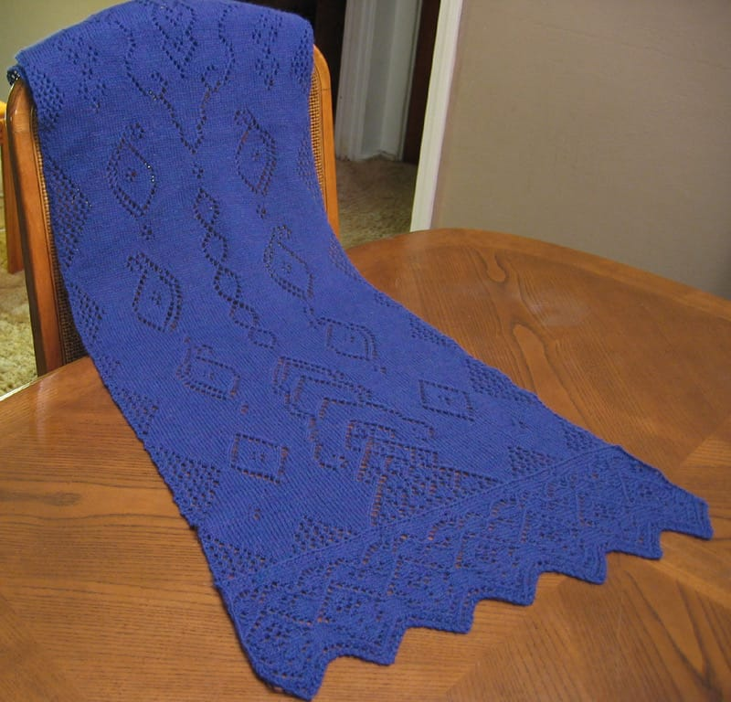
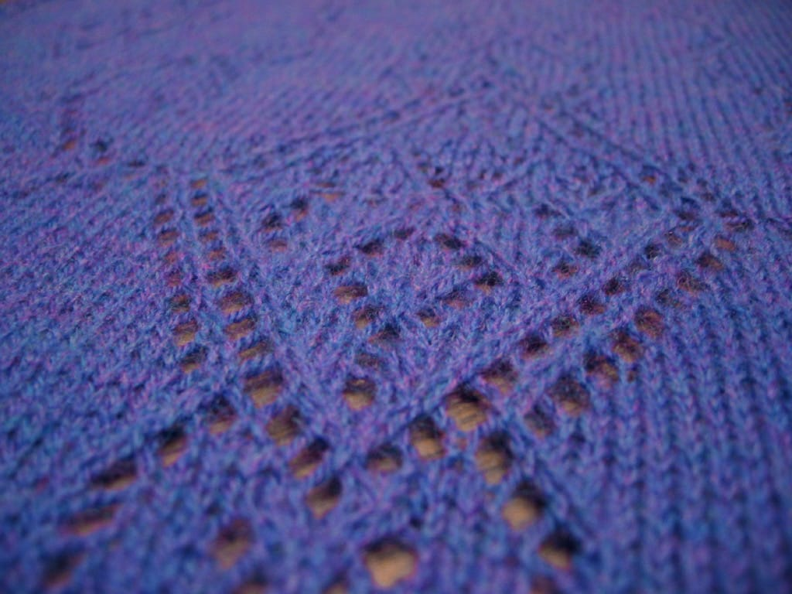
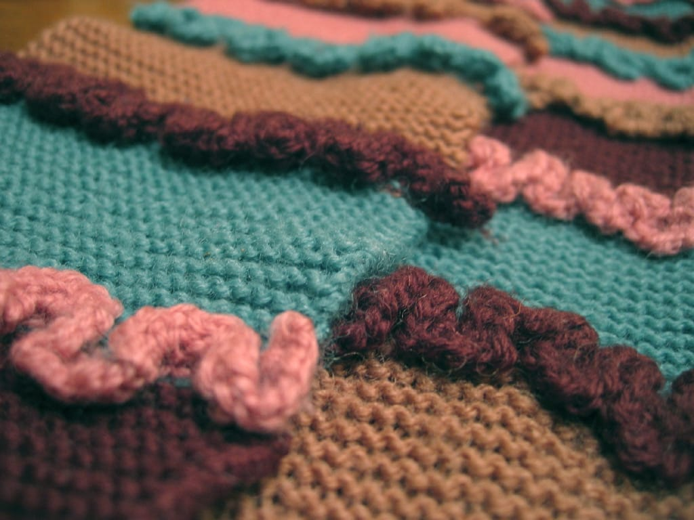

At long last, after two weeks of idling, I’ve taken pictures of my completed Mystery Stole (also known as [Scheherazade](http://pinklemontwist.blogspot.com/2006/10/scheherazade.html))! I traveled a long road of blood, sweat, and tears to get this bad boy completed, and finally, I can show it off.

I started this stole back in July when a few of my local knitting friends turned me on to the idea of a mystery knit a long; I’d done mystery cross stitch pieces before, but never one for knitting. I bought my yarn excitedly before I went on vacation (and ended up having to use a substitute bought from [Vicki](http://simpleknits.blogspot.com) because my order didn’t come in on time!) and eagerly cast on and started the first and second parts while at the beach. (Well, not really.) This will be a piece of cake! I thought to myself. I can get so much done on vacation, and I can catch up and be done when everyone else casts off. Hell, maybe I’ll be the first one done!

But it was not to be. I forgot about the fact that when I got home from vacation, I actually had to work, and full time at that, which didn’t leave me with much time to knit the stole. Still, I plodded along, slowly but surely, and watched as the other members of the knit a long finished theirs. I’m very happy to say I’ve completed mine, finally.

* **Pattern:** [Scheherazade](http://pinklemontwist.blogspot.com/2006/10/scheherazade.html) by Pink Lemon Twist
* **Fiber:** Knit Picks Shadow in Jewels
* **Needles:** US Size 5

I enjoyed knitting this, my first stole and my first foray into lace. I learned the usefulness of lifelines, and invested in stitch markers and a magnet board to hold the pattern. I didn’t really make any changes to the pattern, though if you look closely, you can see the place I accidentally repeated a row twice (yes, this was before I got the magnet board). I am excited to knit another shawl sometime in the future; I’m checking out the Icarus Shawl from the Summer 2006 issue of Interweave Knits and the Swallowtail Shawl from the Fall 2006 issue of Interweave Knits.

But, for now, I’ve cast on another project; Arisaig from Knitty, a project I’ve lusted after since I saw the pattern for the first time in late 2005. I’m using a beautiful purple yarn and am on the ribbing now, knitting with size 1s. I am excited.

Is it sad that I knit this scarf about three years ago, and I’ve just now gotten around to posting pictures of it? I knit my version of [Latifa](http://www.knitty.com/ISSUEfall03/PATTlatifa.html) during the winter of 2004, and I recall it being an interesting project in the sense that knitting ruffles on size 2s is, well, just a little tedious. However, I love the colors I chose as it goes great with my fluffy pink coat and pink hats. It keeps me nice and warm in the winter; I knit it extra long just so I could wrap it around my neck a few times. I love the thing.

I have more recent knitting to show off, but it got too dark before I could take more pictures of it. I’m hoping to post more tomorrow, if 1) I don’t get lazy and 2) if I don’t wait for it to get dark again before taking pictures.

