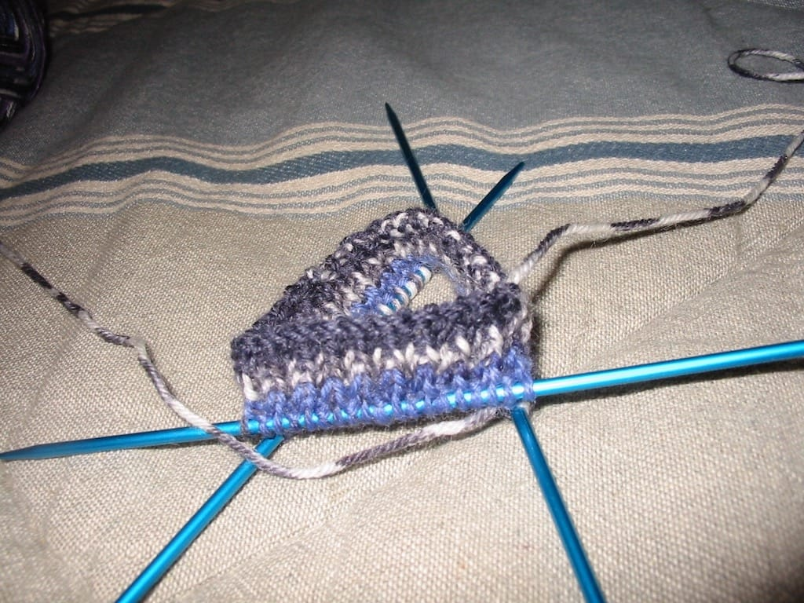

Finally, I’m getting around to completing the second sock of [a pair of socks I began knitting](/posts/one-finished-sock) back in *March*.

I really wish I had kept track of how many rows I had done for the various parts of the first sock; it’s going to be a lot harder to match the two socks in size now. However, I don’t think it will matter that much; I’ll figure it out somehow. So far this sock has been off to a good start, as it only took me *one* try casting on the stitches to begin the ribbing of the sock. I’ve been making extraordinary progress on the sock, which makes me happy because I want to complete it before I work on any of my other knitting projects. I actually probably won’t knit anything for myself after I finish the sock; I need to start on my Christmas presents soon!

I’ll be very happy when this sock is done. I love sock knitting.
