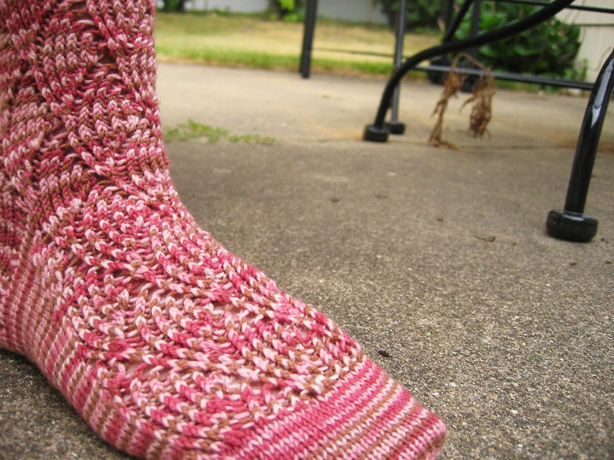
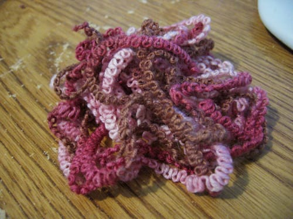
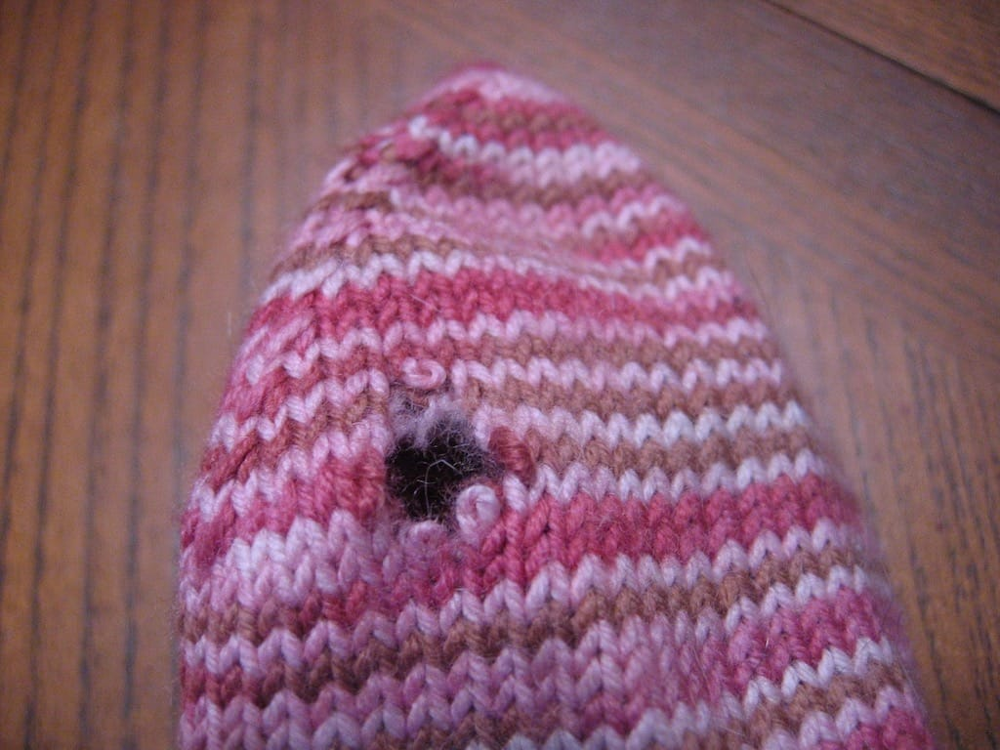

Today, my beautiful [Pomatomus socks](http://www.knitty.com/ISSUEwinter05/PATTpomatomus.html) went from this -

to this -

all because of this -

and now I am sad. I knit these socks last summer while camping in Missouri with Scott's family; I don't believe the temperatures dipped below 95F so I spent the weekend in the shade or in the water, trying my hardest to stay cool.

I love this pattern. However, I knit these socks slightly too big for my small feet; I ripped both so I can knit them a bit smaller next time around. Of course, I'm totally knitting this pattern again because I love it so much. I'm hoping I love it even more with the socks fitting my feet this time around.

Of course, these won't get knit until I finish my [Jaywalkers](http://www.ravelry.com/patterns/library/jaywalker). (On a sidenote, I'm glad I printed the pattern when I did, as [Magknits has been taken down](http://magknits.com). Which is too bad.)

In other news, I'm very psyched it's the weekend. Oh, glorious Saturday and Sunday mornings, how I covet you so.
