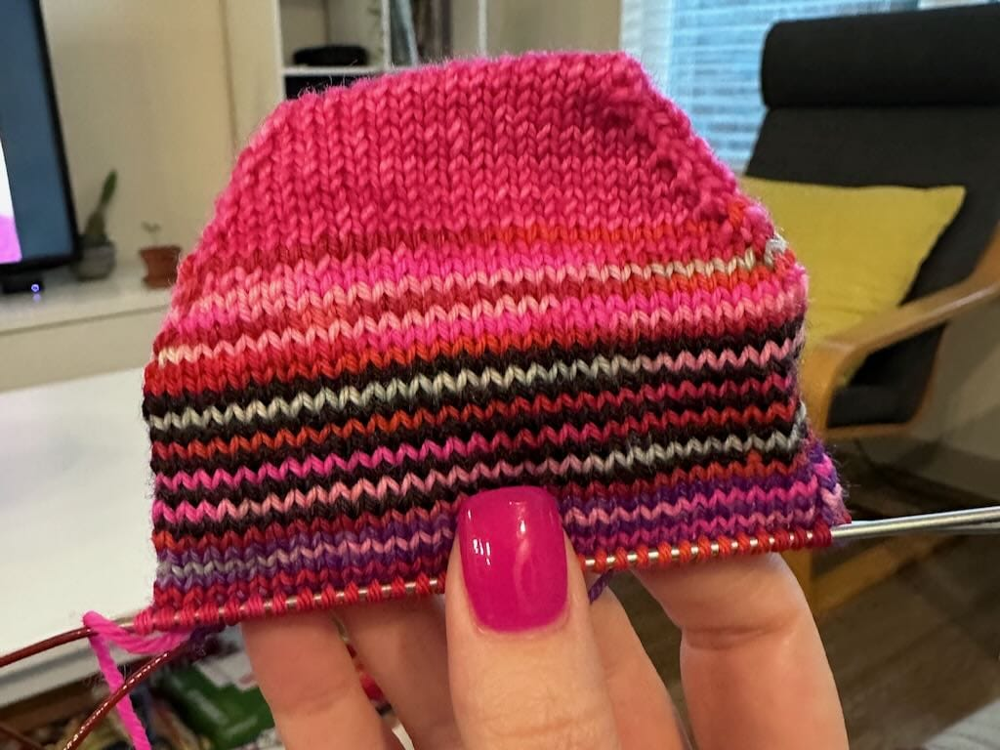

**June 30 - July 6**

At long last, I'm sitting down and writing some week notes after spending a couple weeks starting them and never finishing it before the next week began. This time, I'm committed to posting them on Mondays, so here's my first post!

## Making
* **Knitting**: Yet another pair of ankle socks. This is pretty much all I've been knitting all year, but I'm ready to change it up.

  
* **Spinning**:  [Tour de Fleece](https://spinoffmagazine.com/tour-de-fleece-coming-ready/) started on Saturday, so I'm working on finishing up some yarn I started spinning last year. 

## Watching
* **Finished**: Survivor season 11: Guatemala
* **Watched**: Survivor season 12: Panama and season 13: Cook Islands
* **Started**: Survivor season 14: Fiji

Can you tell I'm on a Survivor kick?

## Reading
* **Finished**: [Wind and Truth](https://app.thestorygraph.com/books/b67a3e79-d844-4032-86a3-a120cfe2115a) by Brandon Sanderson
* **Started**: [Not My Father's Son](https://app.thestorygraph.com/books/230332fc-5eb2-4be9-92bc-c7f441af94a8) by Alan Cumming

## Listening
I haven't listened to any music this week--I'm catching up on podcasts instead.

## Fitness
* **Run**: 2x, 4.13 mi
* **Walk**: 4x, 6.66 mi
* **Yoga**: 4x

Glad to be sticking with 5-6 days a week of exercise, alternating between yoga/walk on one day and run on the other. So far it's working out nicely.

## Blogging / Site stuff
* I wrote one post last week about [A Small Web July](/a-small-web-july). Thanks again, [small cypress](https://smallcypress.bearblog.dev/a-small-web-july/), for starting this!

* I spent some time working on my website this weekend, cleaning up my color palette definitions and changing my colors to use oklch instead of hex. Here are some links I used to help me with the process!

	* [OKLCH Color Picker & Converter](https://oklch.com)
	* [Creating color palettes with OKLCH](https://blog.logrocket.com/oklch-css-consistent-accessible-color-palettes/#creating-color-palettes-with-oklch)
	* [Generating colors with the CSS oklch() function](https://gomakethings.com/generating-colors-with-the-css-oklch-function)

* I also finally created a dark mode for my site and implemented a theme switcher, essentially copying what my former coworker [Adam](https://varn.dev) did on his site. I'm not the only one who implemented a theme switcher this this week--check out some other theme switcher implementations.

	* [Dark/Light Mode Toggle on Bearblog](https://notes.jeddacp.com/darklight-mode-toggle-on-bearblog) by Jedda
	* [How I Added a Light and Dark Mode Toggle on Bear Blog](https://binarydigit.city/light-dark-mode-toggle-bear-blog) by B
