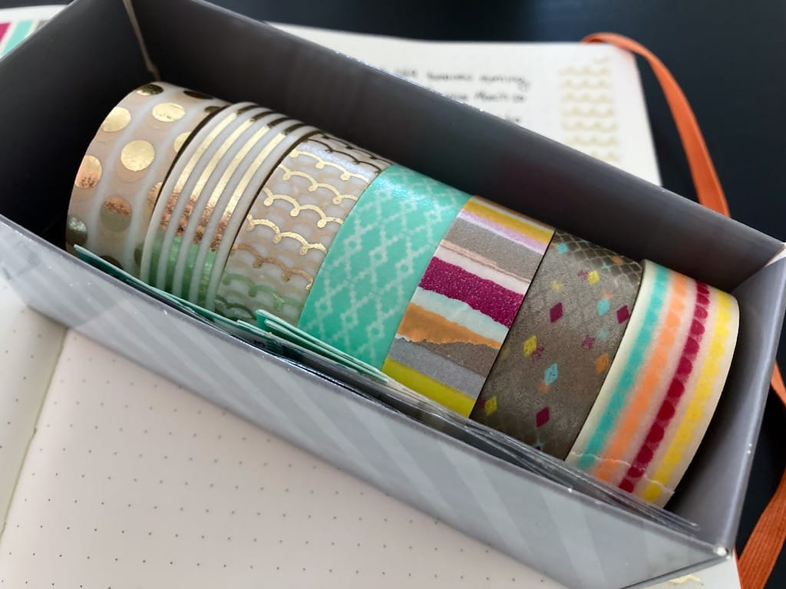

It's been, uhh... two weeks since my last post. Yes. I'm posting this a week late but wait! I have an excuse!

---

- Last Saturday, Adam and I went on a 23 mile bike ride on a bike trail a little outside of the city. Now, going from not riding my bike for a year and a half to riding 23 miles in a single day wasn't the best idea, as I woke up in the middle of the night last Saturday night in excruciating pain. Turns out that increasing distance and riding on a low saddle causes a LOT of knee pain, so I spent last Sunday on the couch resting my knees. Ouch. Next time I ride, I'm raising the saddle a little and not riding more than 5-7 miles. I need to start somewhere!

- Speaking of starting low and slow, I started [Couch to 5k](https://www.runnersblueprint.com/from-couch-to-5k-the-complete-8-week-plan/) again today! Back in 2013 and 2014, I [ran](tags/running). A lot. I ran many 5ks and a couple 10ks in 2013, and in 2014, [I ran a half marathon](posts/providence-half-marathon-race-recap). Sadly, I moved across the country not long after my half and never got back into a running routine, so here I am, 6 months later, starting again. Today's run, alternating 30 seconds of running with a minute of a half of walking, felt a little on the easy plan, but I know that's the best way to start when it comes to running. Now, why I didn't apply this same logic to biking, I don't know. Either way, I'm off to a good start!

- Before the bike ride on Saturday, I updated the font sizes on this site! I used [Utopia](https://utopia.fyi) for the font sizing ratios and while some of the font sizes are a little different, I'm happy with it in general. I still need to tweak a few things, but as always, this website is a work in progress.

- In other exciting news, I'm officially taking a course to become a [Certified Professional in Accessibility Core Competencies](https://www.accessibilityassociation.org/cpacccertification) by the [International Association of Accessibility Professionals (IAAP)](https://www.accessibilityassociation.org/)! I've been interested in web accessibility for years, and this year I'm finally taking the steps to get certified. I've never gotten certified in anything before, so I'm both excited and nervous! A couple coworkers and I are working together to study for this exam later in the fall, and I hope we all pass the first time!

---

I don't really want to make many set goals this week. I'm looking to get next Sunday's Weeknotes post written and continue with Couch to 5k. I'm also hoping to continue practicing yoga on the days I don't run -- I never successfully picked up another activity when I ran last time, and I'm hoping this time I can make both yoga and running stick long term. I feel a lot better staying active and I think this will help my mental health, especially during the pandemic. So, that's it for this week!
