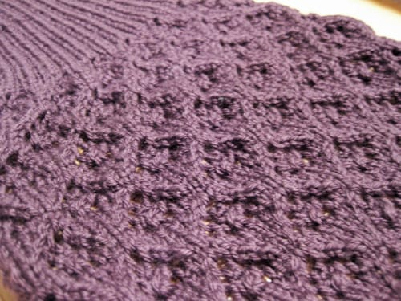

Look what I've picked up again; my [Arisaig cardigan](/posts/knitting-heroes-restaurants-and-relaxation)! Actually, I picked it up again sometime in December, but I didn't really ramp up my progress on the sleeves until recently.

I never really talked about the disaster that struck me last fall; I knit a sleeve, it took me forever, and... the sleeve was too big. I cried. (Well, not really.) I still don't know what I did wrong, but I wasn't happy. So I put the project down for a few months and just recently picked it back up. And now, with a few alterations, I'm almost done with my second first sleeve. I think this one will fit much better, though I am NOT looking forward to knitting the second sleeve. (Technically, the third sleeve, but I don't want to get technical.) I've passed the two year mark since I started this project, and I really want to get it done before the end of this year. Fingers crossed.

I'm still working on my second pair of [wristwarmers](/posts/hey-look-i-do-knit) and my second Monkey sock. I seem to have misplaced the pattern for the wristwarmers and I'm too lazy to look it up online, so I've not touched them for a month. See how lazy I am? The cardigan and the socks have easily accessible patterns in my yarn bag, so I can just pull out the desired project and my nifty Knit Picks chart holder and boom, I'm ready to go. Apparently going to my computer, looking up the wristwarmer pattern, printing it out, and putting it in my yarn bag is too much work for me. I never said I wasn't lazy. (Though, writing this paragraph has inspired me to just *finish the damn things*, already.)

A few weeks ago I came across [Just Bento](http://justbento.com), a site highlighting easy, healthy recipes for [bento lunches](http://justbento.com/handbook/bento-basics). I love the idea of packing lunch in little compartmentalized boxes, and since I bring the same lunch pretty much every day, I figured packing my lunch a little more creatively would jazz it up a bit. I went and bought a little lunch box at Target; while it's not a 'true' bento lunch box, it's allowed me to pack my lunches in more interesting ways. I normally bring a sandwich, yogurt, and some sort of fruit to work for lunch, but recently I've been buying nuts and little snacks to tuck into my box as well. I slice up my sandwich in smaller pieces, peel my oranges and arrange them in the box, and I even folded little origami boxes as containers for the nuts and jellybeans I've used. I try to change it up a little bit from week to week; I'm going to buy rice cakes for next week and probably also buy strawberries in addition to the oranges I already have, just so I can eat some more fruit during lunch. I like variety in my lunches and so far, this has worked out great.

Anyway. As you can see, the above picture is not of one of my lunches, but of a dinner I tried a few weeks ago with a recipe from the Just Bento site. The author makes these dishes for the lunches she makes, but I've been using them for dinners instead. The recipes have been excellent; pictured above is the [Very Easy Marinated Chicken Skewers](http://justbento.com/handbook/recipe-collection-mains/very-easy-marinated-chicken-skewers) recipe. It contains ingredients I already had laying around my apartment, and cooking didn't take very long either; it doesn't look like a lot of food, but I'll eat these meals with rice as well, which works out for me.

Other recipes I've made (and loved!):

* [Sesame Flavored Beef](http://justbento.com/handbook/recipe-collection-mains/sesame-flavored-beef) (I've only made this with pork so far, but it's still delicious!)
* [Japanese Crispy Fried Shrimp](http://justbento.com/handbook/recipe-collection-mains/shrimp-tatsutaage-japanese-crispy-fried-shrimp) (These were AWESOME)
* [Sweet-Sour Red Wine Vinegar Chicken](http://justbento.com/handbook/recipe-collection-mains/sweet-sour-red-wine-vinegar-chicken) (I used chicken breasts instead of thighs, but still, very delicious)

I'm still wanting to try out a few other recipes; I'm glad I came across this site!

***

I had a great time in St Louis! The derby bout was exciting and fast paced and very cool to watch, and I met a few cool people who showed me a good time. The only not so fun part was the 6 hour drive. I'll have to get used to that, however, as I'm driving down to Tennessee this coming weekend for a wedding. Hello, 7-8 hour car ride! But, I'm looking forward to a fun time seeing both Nashville and Gatlinburg! I do love to travel.
