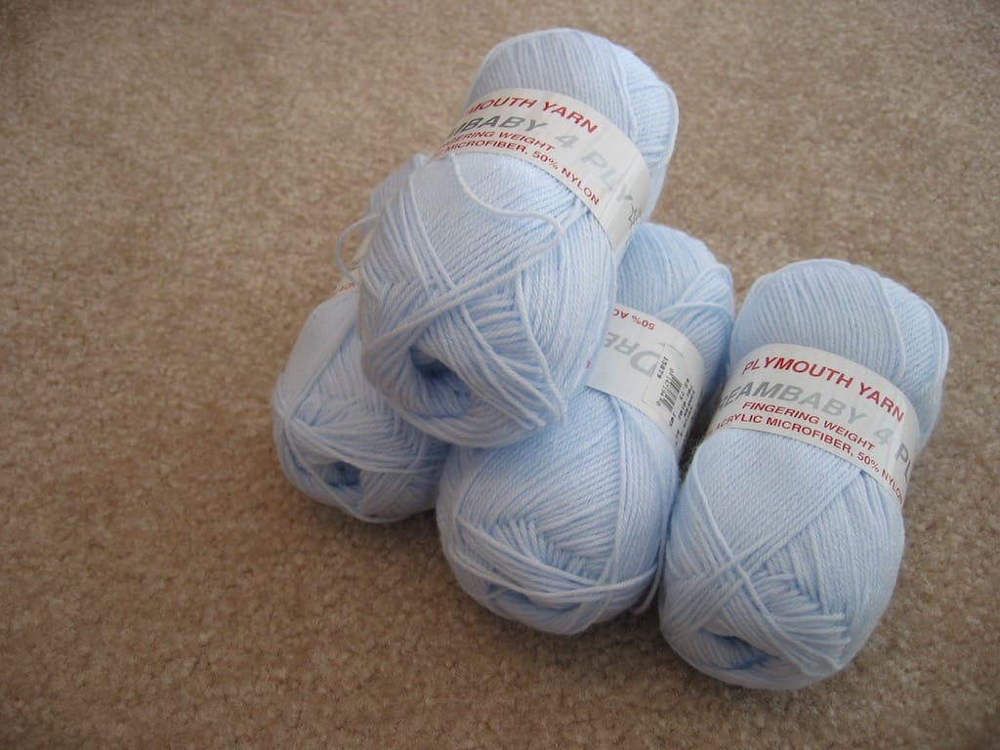
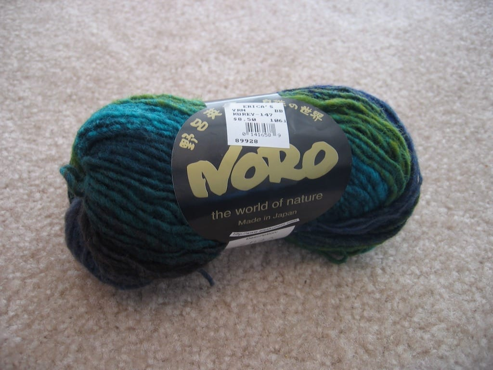

I took a break yesterday from my computer and ventured to a local craft store to shop for yarn; I received a fair amount of gift cards to this place and I need to start knitting a baby blanket for my nephew, who's coming into the world in May. I'm excited; this is my first time becoming an aunt! Anyway, I drove a few minutes down the street to the place and proceeded to poke away at the yarn. I'd only been to the shop one time before, with Scott's mom sometime last fall, and we spent more time looking at the fabrics than the yarns itself.

Yesterday, however, I looked at yarn, yarn, and more yarn; I came across many skeins I wished to buy, but exercised restraint and bought only what I needed. I finally decided on Plymouth Dreambaby for the blanket; it's fingering weight, so I'm doubling it while knitting the blanket. I'm using a blanket pattern I found somewhere online; I wish I remembered the link, but I had to find the pattern via archive.org because the author took the pattern down to improve it. I'll be sure to take pictures of it when I finish it.

I did give in to my urges and bought a skein of Noro Kureyon; I'm in love with the ocean water colors and can't wait to figure out what I'll make out of it. Anyone have any ideas as to what's good to make with this? I'm considering another hat, but who knows.

Sometime I need to take pictures of projects I've completed but never photographed. I'm notoriously bad for never showing off the projects I've finished!
